# Redis事务与集群

## Redis的事务

⚠️ **Redis部分支持事务**

### 是什么？

可以一次执行多个命令，本质是一组命令的集合。一个事物中的所有命令都会被序列化，***按顺序的串行执行而不会被其他命令插入，不许加塞。***

### 能干嘛？

***一个队列中，一次性的，顺序的，排他的执行一系列命令。***

### 常用命令

| 命令            | 描述                                                         |
| --------------- | ------------------------------------------------------------ |
| multi           | 标记一个事务的开始                                           |
| exec            | 执行所有事务块内的命令                                       |
| discard         | 取消事务，放弃执行事务块内的所有命令                         |
| watch key [key] | 监视一个(或多个) key ，如果在事务执行之前这个(或这些) key 被其他命令所改动，那么事务将被打断。 |
| unwatch         | 取消watch命令对所有 key 的监视。                             |


### 怎么玩？

1. **正常执行**

   

2. **放弃事务**

   

3. **全体连坐(便衣时直接报错)**

   

4. **冤头债主（运行时报错）** 部分原子性，所以**Redis部分支持事务**。


### [乐观锁和悲观锁](http://www.silince.cn/2020/08/24/Mysql数据库高级-锁机制/)


### Watch监控 🤔

***watch指令，类似乐观锁，如果key的值已经被修改了，那么整个事务队列都不会被执行，同时返回一个Nullmulti-bulk应答以通知调用者事务执行失败。***

注意：**一旦执行了exec或者discard，之前加的所有监控锁都会被取消掉了。**

例子：

- 初始化信用卡的可用余额和欠额

  

- 无加塞篡改，先监控再开启multi，保证两笔金额变动在同一个事务内

  

- 有加塞篡改，当watch的key被修改，后面的那个事务全部执行失败

  

- unwatch，取消watch命令对所有 key 的监视。

  

- 一旦执行了exec之前加的监控锁都会被取消

#### **小结：**

通过WATCH命令在事务执行之前监控了多个Keys，如果在WATCH之后有任何Key的值发生了变化，EXEC命令执行的食物都将被放弃，同时返回Nullmulti-bulk 应答以通知调用者事务执行失败。


### 事务的3阶段

***开启:以multi开启事务***

***入队:将多个命令入队到事务中,接到这些命令不会立刻执行,而是放到等待执行的事务队列里面***

***执行：有exec命令触发事务***

```mermaid
graph LR 
kai((开启))==>ru((入队))
ru==>zhi((执行))
```



### 事务的3特性

***单独的隔离操作：事务中的所有命令都会序列化，按顺序的执行。事务在等待执行的时候，不会被其他客户端发送来的米命令请求打断***

***没有隔离级别的概念：队列中的所有命令没有提交exec之前都是不会被执行的***

***不保证原子性：redis中如果一条命令执行失败，其后的命令仍然会被执行，没有回滚；部分支持事务。***


## Redis的发布订阅(一般不用)

<h4><a id="_228"></a>发布订阅</h4>
<p>Redis 发布订阅(pub/sub)是一种消息通信模式：发送者(pub)发送消息，订阅者(sub)接收消息。</p>
<p>Redis 客户端可以订阅任意数量的频道。</p>
<p>下图展示了频道 channel1 ， 以及订阅这个频道的三个客户端 —— client2 、 client5 和 client1 之间的关系：<br>
<br/><br/>
当有新消息通过 PUBLISH 命令发送给频道 channel1 时， 这个消息就会被发送给订阅它的三个客户端：<br/>
<br/><br/><br/>
&nbsp;&nbsp;&nbsp;&nbsp;&nbsp;&nbsp;<em><strong>命令</strong></em></p>
<ul>
<li>subscribe channel [channel…]：订阅一个或多个频道的信息</li>
<li>psubscribe pattern [pattern…]：订阅一个或多个符合规定模式的频道</li>
<li>publish channel message ：将信息发送到指定频道</li>
<li>unsubscribe [channel[channel…]]：退订频道</li>
<li>punsubscribe [pattern[pattern…]]：退订所有给定模式的频道</li>
</ul>


&nbsp;&nbsp;&nbsp;&nbsp;&nbsp;&nbsp;<em><strong>应用场景</strong></em>

<blockquote>
构建实时的消息系统，比如普通聊天、群聊等功能。
1、博客网站订阅，当作者发布就可以推送给粉丝
2、微信公众号模式
</blockquote>


## Redis的复制（Master/Slave）🤔

### 是什么？

***就是我们常说的主从复制，主机数据更新后根据配置和策略，自动同步到备机的master/slaver机制，Master以写为主，Slave以读为主。***


### 能干嘛？

- ***读写分离***

- ***容灾恢复***


### 怎么玩？

**配从(库)不配主(库)***

从库配置：slaveof主库IP 主库端口

```shell
# 配置从库
slaveof 主库ip 主库端口
# 查看主从信息
info replication
```

***每次与master断开后，都需要重新连接，除非你配置进redis.conf文件***

修改配置文件细节操作：

1. 拷贝多个redis.conf文件
2. 开启daemonize yes
3. pid文件名字
4. 指定端口
5. Log文件名字
6. Dump.rdp名字

```shell l
# docker 方式搭建
# 79
docker run -p 6379:6379 -v /root/docker/redis/data:/data -v /root/docker/redis/conf/redis.conf:/etc/redis/redis.conf --privileged=true --name myredis -d redis:5.0.7 redis-server /etc/redis/redis.conf
# 80
docker run -p 6380:6379 -v /root/docker/redis/data:/data -v /root/docker/redis/conf/redis.conf:/etc/redis/redis.conf --privileged=true --name myredis80 -d redis:5.0.7 redis-server /etc/redis/redis.conf
# 81
docker run -p 6381:6379 -v /root/docker/redis/data:/data -v /root/docker/redis/conf/redis.conf:/etc/redis/redis.conf --privileged=true --name myredis81 -d redis:5.0.7 redis-server /etc/redis/redis.conf

# ⚠️ 使用如下命令查看容器内网的ip地址等信息  先设置配置文件 bind 0.0.0.0
docker inspect --format '{{ 。NetworkSettings.IPAddress }}' myredis
```


### 常用的主从方式 🤔

####  一主二仆

***含义：就是一个Master两个Slave***


通过`info replication`查看主从信息

```shell
# Replication
role:master
connected_slaves:0
master_replid:f6baff9abfda12ca58048cfce4b0e2c1f4683da1
master_replid2:e8fe596d47d9d1d923d56d884b28128b78d2c1e0
master_repl_offset:0
second_repl_offset:1
repl_backlog_active:0
repl_backlog_size:1048576
repl_backlog_first_byte_offset:0
repl_backlog_histlen:0
```

```shell
# Replication
role:slave
master_host:127.0.0.1
master_port:6379
master_link_status:down
master_last_io_seconds_ago:-1
master_sync_in_progress:0
slave_repl_offset:0
master_link_down_since_seconds:1585217521
slave_priority:100
slave_read_only:1
connected_slaves:0
master_replid:adbec19afa734e84a333b07ea2f33c43c73fe743
master_replid2:0000000000000000000000000000000000000000
master_repl_offset:0
second_repl_offset:-1
repl_backlog_active:0
repl_backlog_size:1048576
repl_backlog_first_byte_offset:0
repl_backlog_histlen:0
```


<span id="zhuyi">注意:</span>

1. ***第一次slave1 和slave2切入点，是全量复制，之后是增量复制***

   

2. ***主机可以写，但是从机不可以写，从机只能读***

   

3. ***主机shutdowm后从机待机状态，等主机回来后，主机新增记录从机可以顺利复制*** 

4. ***从机shutdowm后，每次与master断开之后，都需要重新连接，除非你配置进redis.conf文件***

5. ***从机复制到的数据，会被本机持久化。就算shutdown断开连接依然会有数据。***

6. ***重新连接或者变更master，会清除之前的数据，重新建立拷贝最新的数据***

    

#### 薪火相传

***含义:就是上一个Slave可以是下一个slave的Master，Slave同样可以接收其他slaves的连接和同步请求，那么该slave作为了链条中下一个的master,可以有效减轻master的写压力。***


注意事项和一主二仆差不多,但注意***虽然有slave是相对master，但是依然是slave*** 。

***中途变更转向：会清除之前的数据，重新建立拷贝最新的***


####  反客为主

```shell    
SLAVEOF no one
```

 ***使当前数据库停止与其他数据库的同步，转成主数据库***


#### 哨兵模式（sentinel）

***反客为主的自动版，能够后台监控Master库是否故障，如果故障了根据投票数自动将slave库转换为主库。一组sentinel能同时监控多个Master。***

使用步骤：

1. 在Master对应redis.conf同目录下新建sentinel.conf文件，名字绝对不能错；

2. 配置哨兵，在sentinel.conf文件中填入内容(可以配置多个)：

   ```shell
   #说明：最后一个数字1，表示主机挂掉后slave投票看让谁接替成为主机，得票数多少后成为主机。
   sentinel monitor 被监控数据库名字（自己起名字） ip port 1
   ```

3. 启动哨兵模式(路径按照自己的需求进行配置)：

   ```shell
   redis-sentinel  /myredis/sentinel.conf
   ```


注意：

1. ***当master挂掉后，会通过选票进行选出下一个master。而且只有使用了sentinel.conf启动的才能开启选票***

2. ***当原来的master后来后，很不幸变成了slave。***


### 复制原理

1. Slave启动成功连接到master后会发送一个sync命令；

2. Master接到命令启动后的存盘进程，同时收集所有接收到的用于修改数据集命令，在后台进程执行完毕之后，master将传送整个数据文件到slave，以完成一次完全同步；

3. ***全量复制：而slave服务在数据库文件数据后，将其存盘并加载到内存中；***

4. ***增量复制：Master继续将新的所有收集到的修改命令依次传给slave，完成同步；***

5. 但是只要是重新连接master，一次完全同步（全量复制）将被自动执行。


### 复制的缺点

​       ***延时，由于所有的写操作都是在Master上操作，然后同步更新到Slave上，所以从Master同步到Slave机器有一定的延迟，当系统很繁忙的时候，延迟问题会更加严重，Slave机器数量的增加也会使得这个问题更加严重。***


### 命令

| 命令                                                         | 作用                                             |
| ------------------------------------------------------------ | ------------------------------------------------ |
| slaveof 主库ip  主库端口                                     | 配置从库                                         |
| info replication                                             | 查看redis主从复制的情况                          |
| slaveof  no one                                              | 使当前数据库停止与其他数据库的同步，转成主数据库 |
| sentinel monitor 被监控数据库名字(自己起名字) 127.0.0.1 6379 1 | 配置哨兵，监视master                             |
| redis-sentinel  /myredis/sentinel.conf                       | 以哨兵模式启动redis                              |


## Redis集群

容量不够，redis如何扩容？

并发写操作，redis如何分摊？

### 什么是Redis集群？

Redis集群实现了对Redis的水平扩容，即启动N个redis节点，将整个数据库分布存储在这N个节点中，每个节点存储总数据的1/N

Redis集群通过分区（partition）来提供一定程度的可用性（availability）：即使集群中有一部分节点失效或者无法进行通讯，集群也可以继续处理命令请求。


### 集群搭建

[搭建看这篇文章,有效](http://codekiller.top/2020/03/30/redis-cluster/)

```mermaid
graph LR
yi((导入安装包))-->er((修改配置文件))
er((修改配置文件))-->san((创建基本镜像))
san-->si((创建节点镜像))
si-->|启动6个容器|wu((进入一个redis-cli))
wu-->|cluster meet|liu((集群添加节点))
liu-->qi((配置槽点))
qi-->ba((配置主从高可用))
```




### 集群命令

```shell
CLUSTER INFO 打印集群的信息 
CLUSTER NODES 列出集群当前已知的所有节点（node），以及这些节点的相关信息。  

//节点(node) 
CLUSTER MEET <ip> <port> 将 ip 和 port 所指定的节点添加到集群当中，让它成为集群的一份子。 
CLUSTER FORGET <node_id> 从集群中移除 node_id 指定的节点。 
CLUSTER REPLICATE <node_id> 将当前节点设置为 node_id 指定的节点的从节点。 
CLUSTER SAVECONFIG 将节点的配置文件保存到硬盘里面。  

//槽(slot) 
CLUSTER ADDSLOTS <slot> [slot ...] 将一个或多个槽（slot）指派（assign）给当前节点。 
CLUSTER DELSLOTS <slot> [slot ...] 移除一个或多个槽对当前节点的指派。 
CLUSTER FLUSHSLOTS 移除指派给当前节点的所有槽，让当前节点变成一个没有指派任何槽的节点。 
CLUSTER SETSLOT <slot> NODE <node_id> 将槽 slot 指派给 node_id 指定的节点，如果槽已经指派给另一个节点，那么先让另一个节点删除该槽>，然后再进行指派。 
CLUSTER SETSLOT <slot> MIGRATING <node_id> 将本节点的槽 slot 迁移到 node_id 指定的节点中。 
CLUSTER SETSLOT <slot> IMPORTING <node_id> 从 node_id 指定的节点中导入槽 slot 到本节点。 
CLUSTER SETSLOT <slot> STABLE 取消对槽 slot 的导入（import）或者迁移（migrate）。  

//键 (key) 
CLUSTER KEYSLOT <key> 计算键 key 应该被放置在哪个槽上。 
CLUSTER COUNTKEYSINSLOT <slot> 返回槽 slot 目前包含的键值对数量。 
CLUSTER GETKEYSINSLOT <slot> <count> 返回 count 个 slot 槽中的键。
```


### 节点

1. 一个集群至少要有三个主节点，即要有六个节点。

2. 分配原则尽量保证每个主数据库运行在不同的ip地址，每个从库和主库不在一个ip地址。

3. 当主节点崩了，从节点能自动升为主节点；当主节点再次恢复时，主节点变为slave。参考哨兵模式。

4. redis.conf有个参数cluster-require-full-coverage

   ```shell
   #默认情况下，集群全部的slot有节点负责，集群状态才为ok，才能提供服务。设置为no，可以在slot没有全部分配的时候提供服务。不建议打开该配置。
   # cluster-require-full-coverage yes
   ```

   

   


### SLOTS

- 一个Redis 集群包含16384个插槽(hash slot)， 数据库中的每个键都属于这16384个插槽的其中一个，集群使用公式CRC1 6(key)% 16384来计算键key属于哪个槽(如果有组的话就只算组的部分)，其中`CRC16(key)`语句用于计算键key的CRC16校验和。

- 集群中的每个节点负责处理一部分插槽。 举个例子， 如果一个集群可以有主节点。其中:
  - 节点A负责处理0号至5500号插槽
  - 节点B负责处理5501号至11000号插槽
  - 节点C负责处理11001号至16383号插槽

&nbsp;&nbsp;&nbsp;&nbsp;&nbsp;&nbsp;&nbsp;&nbsp;&nbsp;&nbsp;&nbsp;&nbsp;&nbsp;(注意：每个节点分配的插槽具体数字可能不同，当然可以通过一个小脚本来指定)


**一个疑问：为什么是16384(2^14)，而不是65535(2^16)呢？**

在redis节点发送心跳包时需要把所有的槽放到这个心跳包里，以便让节点知道当前集群信息，16384=16k，在发送心跳包时使用char进行bitmap压缩后是2kb（16384÷8÷1024=2kb），也就是说使用2k的空间创建了16k的槽数65535=65k，压缩后就是8kb（65536÷8÷1024=8kb），也就是说需要需要8k的心跳包。


### Redis Cluster原理

1. node1和node2首先进行握手meet，知道彼此的存在
2. 握手成功后，两个节点会定期发送ping/pong消息，交换数据信息(消息头，消息体)
3. 消息头里面有个字段：unsigned char myslots[CLUSTER_SLOTS/8]，每一位代表一个槽，如果该位是1，代表该槽属于这个节点
4. 消息体中会携带一定数量的其他节点的信息，大约占集群节点总数量的十分之一，至少是3个节点的信息。节点数量越多，消息体内容越大。
5. 每秒都在发送ping消息。每秒随机选取5个节点，找出最久没有通信的节点发送ping消息。
6. 每100毫秒都会扫描本地节点列表，如果发现节点最近一次接受pong消息的时间大于cluster-node-timeout/2,则立即发送ping消息

redis集群的主节点数量基本不可能超过1000个，超过的话可能会导致网络拥堵。


### 在集群中录入值(组的概念)

redis-cli客户端提供-c参数实现自动重定向

```shell
redis-cli -c -p 6379
```

不在一个slot下的键值，是不能使用mget，mset等多键操作

可以通过{}来定义`组的概念`，从而使key中{}内相同内容的键值对放到一个slot中去。

```shell
set user:{info}:name xxx
set age{info} 12
set {info}email 12345@qq.com
hset user{info} name jiang
hset user{info} age 19
hset user{info} eamil 12345@qq.com

#结果
172.17.0.3:6379> keys *
1) "user{info}"
2) "{info}email"
3) "user:{info}:name"
4) "age{info}"
------------------------------------------------------
172.17.0.3:6379> hkeys user{info}
1) "name"
2) "age"
3) "eamil"
```


来源：https://www.codekiller.top/2020/03/30/redis2/