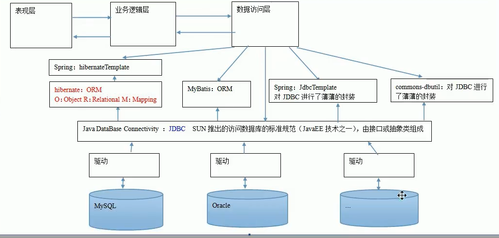

## spring框架的概述以及spring总基于XML的IOC配置

#### 1.spring的概述

1. spring是什么
2. spring的两大核心
3. spring的发展历程和优势
4. spring体系结构

#### 2.程序的耦合及解耦

1. 曾经案例中的问题
2. 工厂模式解耦

#### 3.IOC概念和spring中的IOC

1. spring中给予XML的IOC环境搭建

2. 创建bean的三种方式

   - 方式一：适用默认构造函数创建，在spring的配置文件中适用bean标签，配以id和class属性后，且没有其他属性和标签时。
     - `<bean id="accountService" class="com.itheima.service.impl.AccountServiceImpl"></bean>-->`
   - 方式二：适用普通工厂中的方法创建对象（适用某个类中的方法创建对象，并存入spring容器）
     - ` <bean id="instanceFactory" class="com.itheima.factory.InstanceFactory"></bean>-->`
   - 方式三：适用普通工厂中的静态方法创建对象（适用某个类中的静态方法创建对象，并存入spring容器）
     - ` <bean id="accountService" class="com.itheima.factory.StaticFactory" factory-method="getAccountService"></bean>`
   - bean的作用范围调整。
     - 属性scope：用于指定bean的作用范围。取值：
       -  singleton 单例的，默认值
       - prototype 多例的
       - request 作用于web应用的请求范围
       - session 作用于web应用的绘画范围
       - global-session 作用域集群环境的会话范围（全局会话范围），当不是集群环境时，他就是session
   - bean对象的生命周期
     - 单例对象
       -  出生 容器创建时，对象出生
       - 活着 容器还在，对象一直在
       - 死亡 容器销毁，对象消亡
       - 总结：单例对象的生命周期和容器相同
     - 多例对象
       - 出生 当使用对象时，spring框架为我们创建
       - 活着 对象在使用过程中一直活着
       - 死亡 当对象长时间不用，且没有别的对象引用时，由jvm的垃圾回收器回收

#### 4.依赖注入 Dependecy Injection

```xml
<?xml version="1.0" encoding="UTF-8"?>
<beans xmlns="http://www.springframework.org/schema/beans"
       xmlns:xsi="http://www.w3.org/2001/XMLSchema-instance"
       xsi:schemaLocation="http://www.springframework.org/schema/beans
  http://www.springframework.org/schema/beans/spring-beans.xsd">

    <!--    spring中的依赖注入
        依赖注入： dependency Injection
            IOC的作用：
                降低程序间的耦合（依赖关系）
            依赖关系的管理：以后都交给了spring来维护
            依赖关系：在当前类需要用到其他类的对象，由spring为我们提供，我们只需要在配置文件中说明
            依赖关系的维护就称之为依赖注入。

          依赖注入能注入的数据有三类：
            1 基本类型和String
            2 其他bean类型（在配置文件中活着注解配置过的bean）
            3 复杂类型/集合类型
          注入的方式也有三种：
            1 使用构造函数提供
            2 使用set方法提供
            3 使用注解提供
        -->

    <!--构造函数的注入
        使用的标签 constructor-arg
        标签出现的位置 bean标签的内部
        标签的属性
            type 指定要注入的数据的数据类型，该数据类型也是构造函数中某个或某些参数的类型
            index 用于指定要注入的数据给构造函数中指定索引位置的参数赋值，索引的位置从0开始
            ⭐name 用于指定给构造函数中指定名称的数据赋值
            ===========以上三个听雨指定给构造函数中哪个参数赋值===========
            value 用于指定基本类型和String类型的数据
            ref 用于指定其他的bean类型数据。他指的就是在spring的ioc核心容器中出现过的bean对象

        优势：在获取bean对象时，注入数据是必须的操作，否则对象无法创建成功
        缺点：改变了bean对象的实例化方式，使我们在创建对象时如果用不到这些数据也必须写
    -->
    <bean id="accountService1" class="com.itheima.service.impl.AccountServiceImpl">
        <constructor-arg name="name" value="RIN"></constructor-arg>
        <constructor-arg name="age" value="17"></constructor-arg>
        <constructor-arg name="birthday" ref="now"></constructor-arg>
    </bean>

    <!--    配置一个日期对象-->
    <bean id="now" class="java.util.Date"></bean>


    <!--    ⭐️set方法注入
        涉及的标签 property
        出现的位置 bean的内部
        标签的属性：
            name 用于指定注入时所调用的方法名称
            value 用于指定基本类型和String类型的数据
            ref 用于指定其他的bean类型数据。他指的就是在spring的ioc核心容器中出现过的bean对象

    优势：创建对象时候没有明确的限制，可以直接使用默认构造函数
    弊端：如果有某个成员必须有值，则获取对象时set方法可能没有执行
    -->
    <bean id="accountService2" class="com.itheima.service.impl.AccountServiceImpl2">
        <property name="name" value="LEN"></property>
        <property name="age" value="17"></property>
        <property name="birthday" ref="now"></property>
    </bean>


    <!--    复杂类型/集合类型的注入
            用于给List结构集合注入的标签：list array set
            用于给Map结构集合注入的标签： map props
            结构相同，标签可以互换
    -->
    <bean id="accountService3" class="com.itheima.service.impl.AccountServiceImpl3">
        <property name="myStrs">
            <array>
                <value>AAA</value>
                <value>BBB</value>
                <value>CCC</value>
            </array>
        </property>

        <property name="myList">
            <list>
                <value>AAA</value>
                <value>BBB</value>
                <value>CCC</value>
            </list>
        </property>

        <property name="myMap">
            <map>
                <entry key="AAA" value="aaa"></entry>
            </map>
        </property>

    </bean>
</beans>
```


## spring基于注解的IOC以及IOC案例

> /Users/silince/Develop/MagicDontTouch/IdeaProjects/Java EE/spring/day02_01anno_ioc

#### 1. spring中ioc的常用注解

- 曾经xml配置

```
<bean id="accountService" class="com.itheima.service.impl.AccountServiceImpl"
    scope="" init-method="" destroy-method="">
    <property name="" value="" | ref=""></property>
</bean>
```

*      使用注解的方式：
       *      用于创建对象的:和xml中编写一个bean标签实现的功能相同
              - `@Component`:
                - 把当前类对象存入spring容器
                - 属性：value 用于指定bean的id,不写时默认当前类名且首字母该小写
              - 以下三个注解的作用和属性和Component的作用一摸一样，目的为了明确三层对象
                *             `@Controller`  一般用在表现层
                *             `@Service`  一般用在业务层
                *             `@Repository` 一般用在持久层
       *      用于注入数据的:和xml中bean标签中的property标签的作用相同
              *      `@Autowired`: 
                     *              自动按照类型注入。只要容器中有一个唯一的bean类型和要注入的变量类型匹配，就可以注入成功
                     *      如果有多个匹配时，首先按照类型，然后匹配变量名
                     *      出现位置：可以在成员变量上，也可以在方法上
                     *      细节：在使用注解注入时，set方法就不是必须的了
              *      `@Qualifier`: 
                     *              在按照类型注入的基础上，再按照名称注入。
                     *                            他在给类成员注入时不能单独使用，但是在给方法参数注入时可以
                     *                            属性value： 用于指定注入bean的id
              *      ⭐️`@Resource`:
                     *      直接按照bean的id注入，可以不依托于Autowired独立使用
                     *      属性name：用于指定注入bean的id
       *      Ps:以上三个注解都只能注入其他bean类型的数据，而基本类型和String类型无法使用上述注解实现。另外，集合类型的注入只能通过xml来实现
              *      `@Value`:
                     *      用于注入基本类型和String类型的数据
                     *      属性value：用于指定数据的值。他可以使用spring中的SpEL（spring中的el表达式）
                            *      SpEL写法：`${表达式}$`
       *      用于改变作用范围的:在bean标签中使用scope属性实现的功能相同
              *      `@Scope`:
                     *          用于指定bean的作用范围
                     *          属性： value：指定范围的取值。 常用取值：singleton  prototype
       *      和生命周期相关的:对应 init-method="" destroy-method=""
              *      `@PreDestory`:
                     *          用于指定消费方法
              *      `@PostConstruct`
                     *          用于指定初始化方法

#### 2.⭐️案例使用xml方式和纯注解方式实现单表的CRUD操作

> /Users/silince/Develop/MagicDontTouch/IdeaProjects/Java EE/spring/day02_02account_xmlioc

- 持久层技术选择 dbutils

3. 改造给予注解的ioc案例，使用纯注解的方式实现

   - spring的一些新注解使用
     - `@Configuration`：指定当前类是一个配置类
       - Ps：当配置类作为AnnotationConfigApplicationContex对象创建的参数时，可以不写
     - `@ComponentScan`: 通过注解指定spring在创建容器时要扫描的包
       - 属性 value：他和basePackages的作用是一样的，都是用于指定创建容器时要扫描的包。我们使用此注解就等同于在xml中配置了`<context:component-scan base-package="com.itheima"></context:component-scan>`	
     - `@Bean`：用于把当前方法的返回值作为bean对象存入spring容器中
       - 属性 name：用于指定bean的id，不写时默认值为当前方法的名称
       - Ps：当我们使用注解的方法时，如果方法有参数，spring框架会去容器中查找有没有可用的bean对象。查找的方式和Autowired注解的作用是一样的，自动按照类型/形参的顺序注入。也可以在形参前加上`@Qualifier("name")`来指定要注入的对象。
     - `@Import`:用于导入其他的配置类
       - 属性value：用于指定其他配置类的字节码。但我们使用Import注解之后，有Import注解的类就是父配置类，而导入的都子配置类。
     - `@PropertySource`:用于指定properties文件的位置
       - 属性value：指定文件的名称和路径  关键字`classpath：` 表示类路径下


#### 3.spring和Junit的整合

- 问题分析
  1. 应用程序的入口：main方法
  2. junit单元测试中，没有main方法也能执行：
     - junit集成了一个main方法
     - 该方法就会判断当前测试类中哪些方法有@Test注解
     - junit就让有Test注解的方法执行
  3. junit不会管我们是否采用spring框架
     - 在执行测试方法时，junit根本不知道我们是不是使用类spring框架
     - 所以也就不会为我们读取配置文件/配置类创建spring核心容器
  4. 由以上三点可知，当测试方法执行时，没有IOC容器，就算写了@Autowired注解，也无法实现注入

- 如何整合
  1. 导入spring整合junit的jar（坐标 spring-test）
  2. 使用junit提供的注解把原有的main方法替换成spring提供的
     -  `@Runwith(SpringJUnit4ClassRunner.class)`
  3. 告知spring的运行器，spring和ioc创建是基于xml的还是注解的，并说明位置
     - `@ContextConfiguration() `属性：
       - locations：指定xml文件的位置，加上classpath的关键字，表示在类路径下
       - classes： 注定注解类所在的位置
  4. Ps：当我们使用spring5.x的版本的时候，要求junit的jar必须是4.1.2及以上的版本。

## AOP的相关概念

#### 1. 动态代理：

> /Users/silince/Develop/MagicDontTouch/IdeaProjects/Java EE/spring/day03_01account

- 特点：字节码随用随创建，随用随加载
- 作用：不修改源码的基础上对方法增强
- 分类：
  - 基于接口的动态代理
    - 涉及的类：Proxy 
    - 提供者：JDK官方
    - 如何创建代理对象：使用Proxy类中的newProxyInstance方法
    - 创建代理对象的要求：被代理类最少实现一个接口，如果没有则不能使用
    - newProxyInstance方法的参数：
      - ClassLoader：用于加载代理对象字节码，和被代理对象使用相同的类加载器（固定写法）
      - Class[]：字节码数组，用于让代理对象和被代理对象有相同的方法（固定写法）
      - InvocationHandler：用于提供增强的代码，一般都是写一个该接口的实现类，通常情况下都是匿名内部类，但不是必须的。此接口的实现类都是谁用谁写。

```java
public class Client {
    public static void main(String[] args) {
      	//匿名内部类访问的参数必须为final类型
        final Producer producer = new Producer();
        IProducer proxyProducer = (IProducer)Proxy.newProxyInstance(producer.getClass().getClassLoader(),
                producer.getClass().getInterfaces(), new InvocationHandler() {
                    /** 
                    * @description:  执行被代理对象的任何接口方法都会经过该方法
                    * @param: [o, method, objects] ---[代理对象的引用，当前执行的方法，当前执行方法所需的参数]
                    * @return: java.lang.Object  和被代理对象方法有相同的返回值
                    * @author: Silince 
                    * @date: 2020-04-18 
                    */ 
                    @Override
                    public Object invoke(Object o, Method method, Object[] objects) throws Throwable {
                        // 提供增强的代码
                        Object returnValue=null;
                        //1 获取方法执行的参数
                        Float money = (Float)objects[0];
                        //2 判断当前方法是不是销售
                        if("saleProduct".equals(method.getName())){
                            returnValue=method.invoke(producer,money*0.8f);

                        }
                        return returnValue;
                    }
                });
        proxyProducer.saleProduct(10000f);
    }
}

-----
  public class Producer implements IProducer {
    /**
     * @description: 销售
     * @param: [money]
     * @return: void
     * @author: Silince
     * @date: 2020-04-18
     */
    public void saleProduct(Float money) {
        System.out.println("销售产品，并拿到钱：" + money);
    }

    /**
     * @description: 售后
     * @param: [money]
     * @return: void
     * @author: Silince
     * @date: 2020-04-18
     */
    public void afterService(float money) {
        System.out.println("提供售后服务，并拿到钱：" + money);
    }

}
```

- 基于子类的动态代理
  - 涉及的类：Proxy 
  - 提供者：第三方cglib库
  - 如何创建代理对象：使用Ehancer类中的create方法
  - 创建代理对象的要求：被代理类不能为最终类
  - newProxyInstance方法的参数：
    - Class：字节码，用于指定被代理对象的字节码
    - Callback：用于提供增强的代码，一般都是写一个该接口的实现类，通常情况下都是匿名内部类，但不是必须的。我们一般写的都是该接口的子接口实现类：`MethodInterceptor`

```java
public class Client {
    public static void main(String[] args) {
         //匿名内部类访问的参数必须为final类型
        final Producer producer = new Producer();
        Producer cglibProducer=(Producer)Enhancer.create(producer.getClass(), new MethodInterceptor() {
            /** 
            * @description: 执行被代理对象的任何方法都会经过该方法
            * @param: [o, method, objects, methodProxy]
            * @param: [代理对象的引用，当前执行的方法，当前执行方法所需的参数，当前执行方法的代理对象]
            * @return: java.lang.Object
            * @author: Silince 
            * @date: 2020-04-18 
            */ 
            @Override
            public Object intercept(Object o, Method method, Object[] objects, MethodProxy methodProxy) throws Throwable {
                // 提供增强的代码
                Object returnValue=null;
                //1 获取方法执行的参数
                Float money = (Float)objects[0];
                //2 判断当前方法是不是销售
                if("saleProduct".equals(method.getName())){
                    returnValue=method.invoke(producer,money*0.8f);

                }
                return returnValue;
            }
        });
        cglibProducer.saleProduct(10000f);
    }
}
```

#### 2. AOP的作用和优势

作用：在程序运行期间，不修改源码对已有方法进行增强

优势：减少重复代码，提高开发效率，维护方便

#### 3.spring中基于xml的AOP配置步骤

1. 把通知的bean也交给spring来管理

2.  使用aop:config表明开始AOP的配置

3. 3 使用aop:aspect标签表明配置切面

   - id:给切面提供一个唯一标识
   - ref: 指定通知类bean的Id

4. 在aop:aspect标签的内部使用对应标签来配置通知的类型

   - aop:before 前置通知 
     - method属性：用于指定Logger类中哪个方法是前置通知
     - pointcut属性：用于指定切入点表达式，该表达式的含义指的是对业务层中哪些方法增强
   - aop:after-returning  后置通知 
   - aop:after-throwing 异常通知 
   - aop:after 最终通知 
   - aop:around 环绕通知 

   ```java
       /**
        * 环绕通知
        * 问题：
        *      当我们配置了环绕通知之后，切入点方法没有执行，而通知方法执行了。
        * 分析：
        *      通过对比动态代理中的环绕通知代码，发现动态代理的环绕通知有明确的切入点方法调用，而我们的代码中没有。
        * 解决：
        *      Spring框架为我们提供了一个接口：ProceedingJoinPoint。该接口有一个方法proceed()，此方法就相当于明确调用切入点方法。
        *      该接口可以作为环绕通知的方法参数，在程序执行时，spring框架会为我们提供该接口的实现类供我们使用。
        *
        * spring中的环绕通知：
        *      它是spring框架为我们提供的一种可以在代码中手动控制增强方法何时执行的方式。
        */
       public Object aroundPringLog(ProceedingJoinPoint pjp){
           Object rtValue = null;
           try{
               Object[] args = pjp.getArgs();//得到方法执行所需的参数
   
               System.out.println("Logger类中的aroundPringLog方法开始记录日志了。。。前置");
   
               rtValue = pjp.proceed(args);//明确调用业务层方法（切入点方法）
   
               System.out.println("Logger类中的aroundPringLog方法开始记录日志了。。。后置");
   
               return rtValue;
           }catch (Throwable t){
               System.out.println("Logger类中的aroundPringLog方法开始记录日志了。。。异常");
               throw new RuntimeException(t);
           }finally {
               System.out.println("Logger类中的aroundPringLog方法开始记录日志了。。。最终");
           }
       }
   ```

   

5. 切入点表达式的写法：

```xml
访问修饰符可以省略
void com.itheima.service.impl.AccountServiceImpl.saveAccount()
返回值可以使用通配符，表示任意返回值
* com.itheima.service.impl.AccountServiceImpl.saveAccount()
包名可以使用通配符，表示任意包。但是有几级包，就需要写几个*.
* *.*.*.*.AccountServiceImpl.saveAccount())
包名可以使用..表示当前包及其子包
* *..AccountServiceImpl.saveAccount()
类名和方法名都可以使用*来实现通配
* *..*.*()
参数列表：
可以直接写数据类型：
基本类型直接写名称           int
引用类型写包名.类名的方式   java.lang.String
可以使用通配符表示任意类型，但是必须有参数
可以使用..表示有无参数均可，有参数可以是任意类型
全通配写法：
* *..*.*(..)

实际开发中切入点表达式的通常写法：
切到业务层实现类下的所有方法
* com.itheima.service.impl.*.*(..)

⭐️<!-- 配置切入点表达式 id属性用于指定表达式的唯一标识。expression属性用于指定表达式内容
              此标签写在aop:aspect标签内部只能当前切面使用。
              它还可以写在aop:aspect外面，此时就变成了所有切面可用
-->
        <aop:pointcut id="pt1" expression="execution(* com.itheima.service.impl.*.*(..))"></aop:pointcut>
```
#### 4.spring中基于注解的AOP配置步骤

⭐️有顺序调用的问题，慎重使用。

```java
@Component("logger")
@Aspect//表示当前类是一个切面类
public class Logger {

    @Pointcut("execution(* com.itheima.service.impl.*.*(..))")
    private void pt1(){}

    /**
     * 前置通知
     */
//    @Before("pt1()")
    public  void beforePrintLog(){
        System.out.println("前置通知Logger类中的beforePrintLog方法开始记录日志了。。。");
    }

    /**
     * 后置通知
     */
//    @AfterReturning("pt1()")
    public  void afterReturningPrintLog(){
        System.out.println("后置通知Logger类中的afterReturningPrintLog方法开始记录日志了。。。");
    }
    /**
     * 异常通知
     */
//    @AfterThrowing("pt1()")
    public  void afterThrowingPrintLog(){
        System.out.println("异常通知Logger类中的afterThrowingPrintLog方法开始记录日志了。。。");
    }

    /**
     * 最终通知
     */
//    @After("pt1()")
    public  void afterPrintLog(){
        System.out.println("最终通知Logger类中的afterPrintLog方法开始记录日志了。。。");
    }


    @Around("pt1()")
    public Object aroundPringLog(ProceedingJoinPoint pjp){
        Object rtValue = null;
        try{
            Object[] args = pjp.getArgs();//得到方法执行所需的参数

            System.out.println("Logger类中的aroundPringLog方法开始记录日志了。。。前置");

            rtValue = pjp.proceed(args);//明确调用业务层方法（切入点方法）

            System.out.println("Logger类中的aroundPringLog方法开始记录日志了。。。后置");

            return rtValue;
        }catch (Throwable t){
            System.out.println("Logger类中的aroundPringLog方法开始记录日志了。。。异常");
            throw new RuntimeException(t);
        }finally {
            System.out.println("Logger类中的aroundPringLog方法开始记录日志了。。。最终");
        }
    }
}
```

## spring中JdbcTemplate的使用

> /Users/silince/Develop/MagicDontTouch/IdeaProjects/Java EE/spring/day04_01jdbcTemplate



1. JdbcTemplate的作用：他用于和数据库交互的，实现对表的CRUD操作
2. 如何创建该对象
   1. 需要导入的坐标
      - spring-jdbc
      - spring-tx 用于控制事务
      - mysql-connector-java
      - spring-context
3. 对象中的常用方法


## spring中的事务控制

#### spring中基于xml的声明式事务控制配置步骤

       1. 配置事务管理器
    2. 配置事务的通知(此时我们需要导入事务的约束 tx名称空间和约束，同时也需要aop)
        - 使用tx:advice标签配置事务通知。属性:
          - id:给事务通知起一个唯一标识
          - transaction-manager: 给事务通知提供一个事务管理器应用
    3. 配置aop中的通用切入点表达式
    4. 建立事务通知和切入点表达式的对应关系
    5. 配置事务的属性，在事务的通知`tx:advice`标签内部配置
        - isolation ：用于指定事务的隔离级别，默认值是DEFAULT,表示使用数据库的默认隔离级别
        - propagation：用于指定事务的传播行为，默认值为REQUIRED，表示一定会有事务（增删改的选择），查询方法可以选择SUPPORTS
        - read-only：用于指定事务是否只读，只有查询方法才能设置为true。默认值为false，表示读写。
        - timeout：用于指定事务的超时时间，默认值-1，表示用不超时。如果指定了数值，以秒为单位
        - rollback-for：用于指定一个异常，产生该异常时事务回滚，其他异常不回滚。没有默认值，表示任何异常都回滚
        - no-rollback： 用于指定一个异常，产生该异常时事务不回滚，其他异常回滚。没有默认值，表示任何异常都不回滚

```xml
    <!--    配置事务管理器-->
    <bean id="transactionManager" class="org.springframework.jdbc.datasource.DataSourceTransactionManager">
        <property name="dataSource" ref="dataSource"/>
    </bean>
    <!--    配置事务的通知-->
    <tx:advice id="txAdvice" transaction-manager="transactionManager">
<!--        配置事务的属性-->
        <tx:attributes>
            <tx:method name="*" propagation="REQUIRED" read-only="false"/>
<!--            部分匹配优先级高-->
            <tx:method name="find*" propagation="SUPPORTS" read-only="true"/>
        </tx:attributes>
    </tx:advice>
    <!--    配置aop-->
    <aop:config>
        <!--        配置切入点表达式-->
        <aop:pointcut id="pt1" expression="execution(* com.itheima.service.impl.*.*(..))"/>
        <!--        建立事务通知和切入点表达式的对应关系-->
        <aop:advisor advice-ref="txAdvice" pointcut-ref="pt1"/>
    </aop:config>
```


#### spring中基于注解的声明式事务控制配置步骤

       1. 配置事务管理器
       2. 开启spring对注解事务的支持
          - `<tx:annotation-driven transaction-manager="transactionManager"/>`
          - `@EnableTransactionManagement`
       3. 在需要事务支持的地方使用`@Transactional`注解


