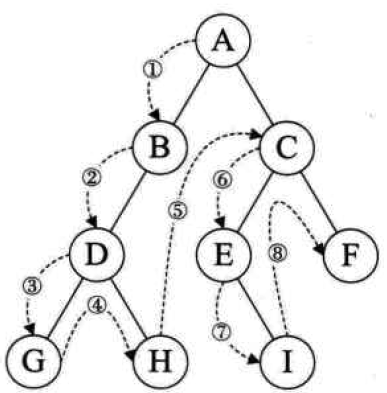

# 二叉树的分类

## 满二叉树

> 它们在顺序存储方式下可以复原

### 满二叉树的定义

一棵深度为 k 且有 $2^k-1$ 个节点的二叉树成为 ***满二叉树***。

### 满二叉树的特点

- 每一层上的节点数都是最大节点数，即每层都满
- 叶子结点全部在最底层 

### 满二叉树的编号

- 编号规则：从根结点开始，自上而下，自左而右
- 每一节点位置都有元素

### 例子

下面是一棵深度为 4 ，有$2^4-1=15$ 个节点的满二叉树。

 


## 完全二叉树

> 它们在顺序存储方式下可以复原

### 完全二叉树的定义

深度为 k 的具有 n 个节点的二叉树，***当且仅当其每一个节点都与深度为 k 的满二叉树中编号为 1～n 的节点 一一对应时，称之为 完全二叉树。***


ps：在满二叉树中，从最后一个节点开始，***连续去掉任意个节点***，即是一棵完全二叉树。

### 完全二叉树的特点

- 叶子结点只可能分布在层次最大的两层上
- 对任一节点，如果其右子树的最大层次为 i ，则其左子树的最大层次必为 i 或 i+1


## 二叉查找树/二叉排序树/二叉搜索树

二叉排序树（BST，Binary Sort Tree）的性质：

- 有非叶子结点至多拥有两个儿子（Left和Right）；
- 所有结点存储一个关键字；

- 对于二叉树中的任意节点，如果它有左子树或右子树，则***该节点的数据成员大于左子树所有节点的数据成员，且小于右子树所有节点的数据成员***。
- 排序二叉树的中序遍历结果是从小到大排列的。


## 平衡二叉树

### 平衡二叉树的定义

也被称为AVL树(Adelson-Velskii and Landis)，一棵平衡二叉树可以是空树，也可以是具有下列性质的二叉排序树：

1. 左子树与右子树的高度之差的绝对值小于等于1
2. 左子树和右子树也是平衡二叉排序树

### 平衡因子

为了方便起见，给每个节点附加一个数字，给出该节点左子树与右子树的高度差。这个数字称为节点的平衡因子BF.
$$
平衡因子 = 节点左子树的高度 - 节点右子树的高度
$$
***根据平衡二叉树的定义，平衡二叉树上所有节点的平衡因子只能是-1、0或1。***

对于一棵有 n 个节点的AVL树，其高度保持在 $O(log_2n)$ 数量级，ASL也保持在 $O(log_2n)$ 数量级。


## B树(B_树)和B+树：

> [面试官问你B树和B+树，就把这篇文章丢给他](https://my.oschina.net/u/4116286/blog/3107389)

### B树(B-树)

B树也称B-树,它是一颗多路平衡查找树，B树的定义：

- 每个节点最多有m-1个**关键字**（可以存有的键值对）。
- 根节点最少可以只有1个**关键字**。
- 非根节点至少有m/2个**关键字**。
- 每个节点中的关键字都按照从小到大的顺序排列，每个关键字的左子树中的所有关键字都小于它，而右子树中的所有关键字都大于它。
- 所有叶子节点都位于同一层，或者说根节点到每个叶子节点的长度都相同。
- 每个节点都存有索引和数据，也就是对应的key和value。

所以，根节点的**关键字**数量范围：`1 <= k <= m-1`，非根节点的**关键字**数量范围：`m/2 <= k <= m-1`。

另外，我们需要注意一个概念，描述一颗B树时需要指定它的阶数，阶数表示了一个节点最多有多少个孩子节点，一般用字母m表示阶数。

我们再举个例子来说明一下上面的概念，比如这里有一个5阶的B树，根节点数量范围：1 <= k <= 4，非根节点数量范围：2 <= k <= 4。


### B+树

B+树其实和B树是非常相似的，我们首先看看**相同点**。

- 根节点至少一个元素
- 非根节点元素范围：m/2 <= k <= m-1

**不同点：**

- B+树有两种类型的节点：内部结点（也称索引结点）和叶子结点。内部节点就是非叶子节点，内部节点不存储数据，只存储索引，数据都存储在叶子节点。
- 内部结点中的key都按照从小到大的顺序排列，对于内部结点中的一个key，左树中的所有key都小于它，右子树中的key都大于等于它。叶子结点中的记录也按照key的大小排列。
- 每个叶子结点都存有相邻叶子结点的指针，叶子结点本身依关键字的大小自小而大顺序链接。
- 父节点存有右孩子的第一个元素的索引。


### B树(B-树)和B+树区别

1. 关键字数量不同：B+树分支结点M个关键字，叶子节点也有M个；B树分支结点则存在 k-1 个关键码
2. 数据存储位置不同：B+树数据存储在叶子结点上；B树存储在每个结点上；
3. 查询不同：B+树是从根节点到叶子节点的路径；B树是只需要找到数据就可以
4. 分支节点存储信息不同：B+树存索引信息；B树存的是数据关键字

### 小结

**B树/B-树：**多路搜索树，每个结点存储M/2到M个关键字，非叶子结点存储指向关键字范围的子结点；所有关键字在整颗树中出现，且只出现一次，非叶子结点可以命中；

**B+树：**在B-树基础上，为叶子结点增加链表指针，所有关键字都在叶子结点中出现，非叶子结点作为叶子结点的索引；B+树总是到叶子结点才命中；

B+树相对于B树有一些自己的***优势***，可以归结为下面几点。

- 单一节点存储的元素更多，使得查询的IO次数更少，所以也就使得它更适合做为数据库MySQL的底层数据结构了。
- 所有的查询都要查找到叶子节点，查询性能是稳定的，而B树，每个节点都可以查找到数据，所以不稳定。
- 所有的叶子节点形成了一个有序链表，更加便于查找。

---

# 二叉树的遍历与实现

## 递归实现二叉树的遍历

### 前序遍历



基本思想：若二叉树为空，则返回。否则从根结点开始，优先访问根结点，再前序遍历左子树，前序遍历右子树，即**根——左——右**

图中按照前序遍历的访问结果为：A、B、D、G、H、C、E、I、F

```java
/**
     * 前序遍历（根左右）
     * output:A、B、D、G、H、C、E、I、F
     * @param root
     */
public void preOrder(TreeNode root) {

  if (root == null) {
    return;
  } else {
    System.out.println("preOrder data:" + root.getData());
    preOrder(root.leftChild);
    preOrder(root.rightChild);
  }
}
```

### 中序遍历


基本思想：若二叉树为空，则返回。否则优先中序遍历左子树，再访问根结点，再后序遍历右子树，即**左——根——右**

图中按照中序遍历的访问结果为：G、D、H、B、A、E、I、C、F

使用代码递归来实现中序遍历，如下所示：

```java
/**
     * 中序遍历（左根右）
     * output:G、D、H、B、A、E、I、C、F
     * @param root
     */
public void midOrder(TreeNode root) {

  if (root == null) {
    return;
  } else {
    midOrder(root.leftChild);
    System.out.println("midOrder data:" + root.getData());
    midOrder(root.rightChild);
  }
}
```

### 后序遍历


基本思想：若二叉树为空，则返回。否则优先后序遍历左子树，再后序遍历右子树，最后访问根结点，，即**左——右——根**

图中按照后序遍历的访问结果为：G、H、D、B、I、E、F、C、A

使用代码递归来实现后序遍历，如下所示：

```java
/**
* 后序遍历（左右根）
* output:G、H、D、B、I、E、F、C、A
* @param root
*/
public void postOrder(TreeNode root){

  if (root == null) {
    return;
  } else {
    postOrder(root.leftChild);
    postOrder(root.rightChild);
    System.out.println("postOrder data:" + root.getData());
  }
}
```

## 非递归实现二叉树的遍历

### 利用栈进行前序遍历


每访问一个结点后，在向左子树遍历下去之前，利用栈来记录该结点的右子女（如果有的话），以便在左子树退回时可以直接从栈顶取得右子树的根结点，继续其右子树的遍历。上图是过程的演示，先将null压入栈中，当栈中无元素时将其推出，表示结束。

```java
/**
* 前序遍历非递归算法
  * output:A-B-D-E-C-F
    * @param root
    */
public void preOrderNonRecursive(TreeNode root) {

  Stack<TreeNode> nodeStack = new Stack<>();
  nodeStack.push(null);
  while (root != null) {
    // 访问根结点
    System.out.println("preOrderNonRecursive data:" + root.getData());
    // 当前结点右子树不为空则放入栈中
    if (root.rightChild != null)
      nodeStack.push(root.rightChild);
    // 访问左子树
    if (root.leftChild != null)
      root = root.leftChild;
    else root = nodeStack.pop();
  }
}
```

### 利用栈进行中序遍历

从根结点开始沿着leftChild到最下角的结点，将指针依次压入栈中，直到该结点的leftChild指针为NULL。访问它的数据后，再遍历该结点的右子树。此时该结点为栈中推出的指针。

```java
/**
* 中序遍历非递归算法
  * output:D-B-E-A-F-C
    * @param root
    */
public void midOrderNonRecursive(TreeNode root) {

  Stack<TreeNode> nodeStack = new Stack<>();
  do {
    while (root != null) {
      nodeStack.push(root);
      root = root.leftChild;
    }

    if (!nodeStack.empty()) {
      root = nodeStack.pop();
      System.out.println("preOrderNonRecursive data:" + root.getData());
      root = root.rightChild;
    }
  } while (root != null || !nodeStack.empty());
}
```

### 利用栈进行后序遍历

因为后序遍历的访问顺序为左右根，所以在访问的时候比较麻烦，需要考虑到访问完左结点后，当前结点有无右结点需要访问，若有则需要右进访问右子树，所以要有一个变量来记录当前结点。

- 从根结点开始沿着leftChild到最下角的结点，将指针依次压入栈中，直到该结点的leftChild指针为NULL。
- 判断当前结点有无右子树，若有，则优先访问右子树
- 无右子树货已经访问过右子树则访问当前结点

```java
/**
* 后序遍历非递归算法
  * output:D-E-B-F-C-A
    *
    * @param root
    */
public void postOrderNonRecursive(TreeNode root) {

  Stack<TreeNode> nodeStack = new Stack<>();
  // 上一个结点
  TreeNode prev = root;
  do {
    while (root != null) {
      nodeStack.push(root);
      root = root.leftChild;
    }

    // 访问当前结点的右结点
    if (!nodeStack.empty()) {
      // 获取右子树，但先不弹出
      TreeNode temp = nodeStack.peek().rightChild;
      // 不存在右子树或右子树已经访问过，可以访问父结点
      if (temp == null || temp == prev) {

        root = nodeStack.pop();
        System.out.println("postOrderNonRecursive data:" + root.getData());
        // 记录访问过的结点
        prev = root;
        // 当前结点置空
        root = null;
      } else {
        // 存在右子树，需要优先访问右子树
        root = temp;
      }
    }
  } while (root != null || !nodeStack.empty());
}
```

# 获取二叉树的高度和度

## 获取二叉树高度

树的性质第12点：叶结点的高度为1，非叶结点的高度等于它子女结点高度的最大值加1。核心思想是递归实现

```java
/**
* 求二叉树的深度（高度）
  *
  * @return
  */
public int getHeight() {
  return getHeight(root);
}

/**
* 求二叉树的深度（高度）
  *
  * @param root
  * @return
  */
private int getHeight(TreeNode root) {
  if (root == null) {
    return 0;
  } else {
    int i = getHeight(root.leftChild);
    int j = getHeight(root.rightChild);
    return i >= j ? i + 1 : j + 1;
  }
}
```

## 获取二叉树的度

```java
/**
  * 求二叉树的结点数
  *
  * @return
  */
public int getSize() {
  return getSize(root);
}

/**
* 求二叉树的结点数
  *
  * @param root
  * @return
  */
private int getSize(TreeNode root) {

  if (root == null) {
    return 0;
  } else {
    return 1 + getSize(root.leftChild) + getSize(root.rightChild);
  }
}
```

# 创建一棵二叉树

```java
// 结点类
public class TreeNode {
        int val = 0;
        TreeNode left = null;
        TreeNode right = null;
    
        public TreeNode(int val) {
            this.val = val;
        }
    }

public class CreateBinaryTree {
    // 前序遍历测试
    public static void main(String[] args) {
        TreeNode node = CreateBinaryTree.createBT(new int[]{1, 2, 3, 4, 5,6}, 0);
        CreateBinaryTree.preOrder(node); //124536
    }
		// 构建二叉树 (完全二叉树)
    public static TreeNode createBT(int[] arr, int i) // 初始时,传入的i==0
    {
        TreeNode root = null; // 定义根节点

        if (i >= arr.length) // i >= arr.length 时,表示已经到达了根节点
            return null;

        root = new TreeNode(arr[i]); // 根节点
        root.left = createBT(arr, 2 * i + 1); // 递归建立左孩子结点
        root.right = createBT(arr, 2 * i + 2); // 递归建立右孩子结点

        return root;
    }

    /**
     * @description: 前序遍历
     */
    public static void preOrder(TreeNode root) {

        if (root == null) {
            return;
        } else {
            System.out.println("preOrder data:" + root.val);
            preOrder(root.left);
            preOrder(root.right);
        }
    }
}
```


# 层序遍历

层序遍历依照从根结点开始，自上而下，从左到右。需要有一个结构来存储当前层的结点，当访问完当前层结点后，将其抛出后继续访问下层结点，队列的先进先出符合这一要求。

- 将根结点压入队列中
- 队列不为空则开始循环，此时只有根结点，则推出根结点并访问。判断根结点有无左右子树，若有则将其压入队列中
- 队列为空，结束循环

```java
/**
* 层序遍历
*
* @param root
*/
public List<List<String>> levelOrder(TreeNode root) {

  List<List<String>> reList = new ArrayList<>();
  Queue<TreeNode> nodeQueue = new LinkedList<>();
  // 压入根结点
  nodeQueue.offer(root);
  while (!nodeQueue.isEmpty()) {
    int levelSize = nodeQueue.size();
    List<String> subList = new ArrayList<>();
    while (levelSize != 0) {
      TreeNode temp = nodeQueue.poll();
      subList.add(temp.getData() + "");
      if (temp.leftChild != null) nodeQueue.offer(temp.leftChild);
      if (temp.rightChild != null) nodeQueue.offer(temp.rightChild);
      levelSize--;
    }
    reList.add(subList);
  }

  return reList;
}
```

# 通过前序遍历复制一棵二叉树

为了实现二叉树的复制方法，可以利用二叉树的前序遍历算法。若二叉树parent不为空，则首先复制根结点，这相当于二叉树前序遍历中访问根结点的语句；然后分别复制二叉树的左子树和右子树，这相当于二叉树前序遍历算法中的遍历左子树和右子树。整个算法的思想是递归。

```java
/**
* 复制一棵二叉树
* @param parent
* @return
*/
public TreeNode copy(TreeNode parent){

  if(parent == null)
    return null;

  // 构造根结点
  TreeNode temp = new TreeNode(parent.getIndex(),parent.getData());

  // 递归构造左子树
  temp.leftChild = copy(parent.leftChild);

  // 递归构造右子树
  temp.rightChild = copy(parent.rightChild);

  return temp;
}
```

# 判断两棵树是否相等

递归判断每个结点的`s.data == t.data`是否成立即可

```java
/**
* 判断两棵树是否相等
* @param s
* @param t
* @return
*/
public boolean euqal(TreeNode s,TreeNode t){

  if(s == null && t == null)
    return true;

  if(s != null && t != null && s.data == t.data &&
     euqal(s.leftChild,t.leftChild) &&
     euqal(s.rightChild,t.rightChild))
    return true;
  else
    return false;
}
```