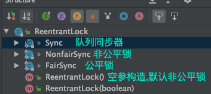
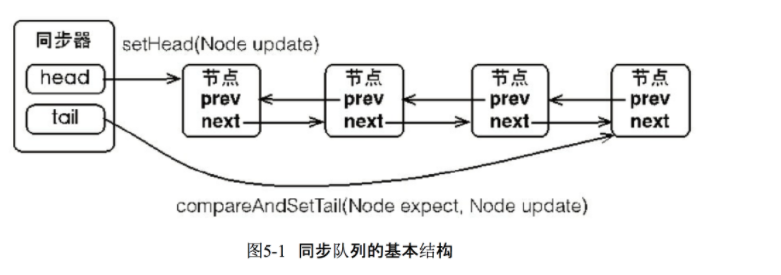
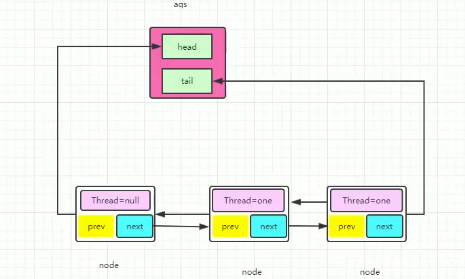
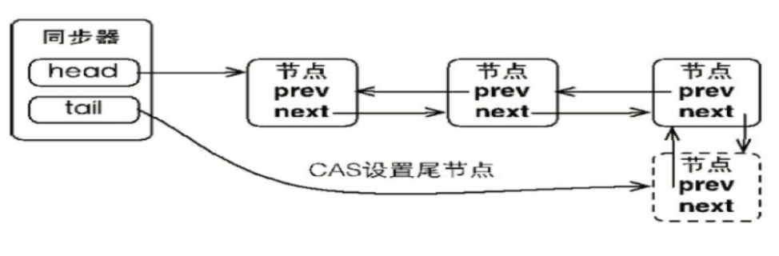
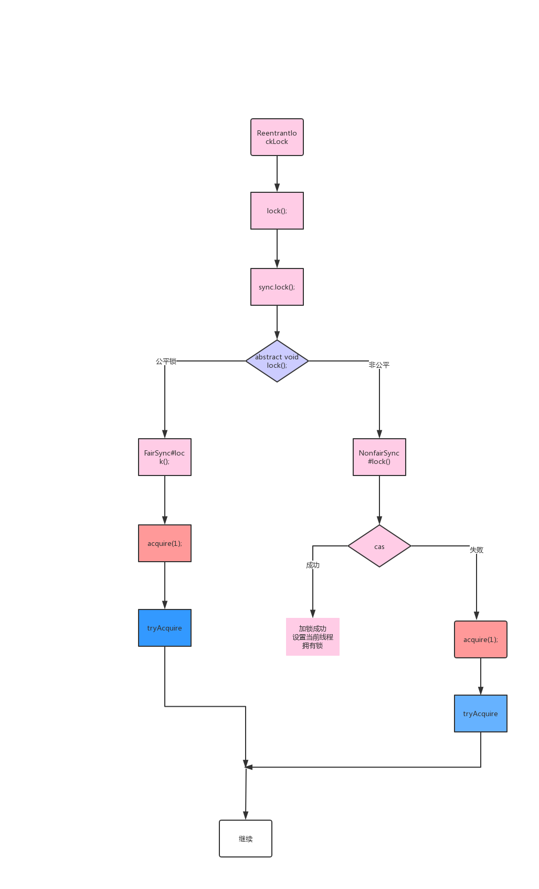
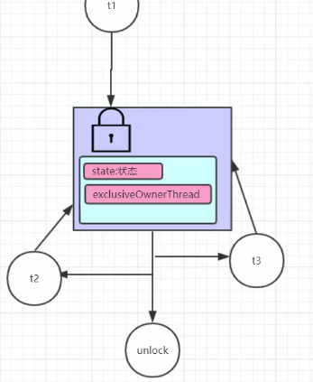
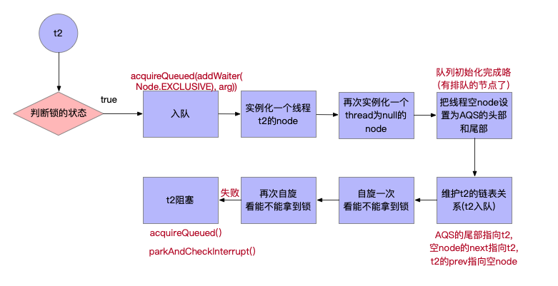
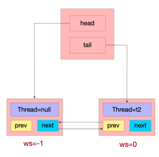
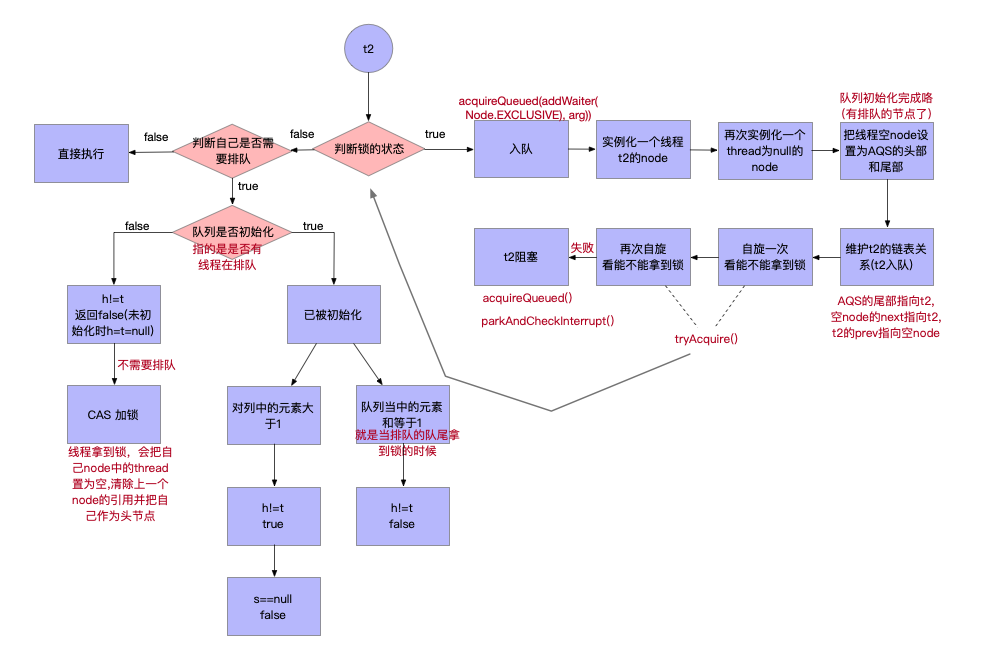
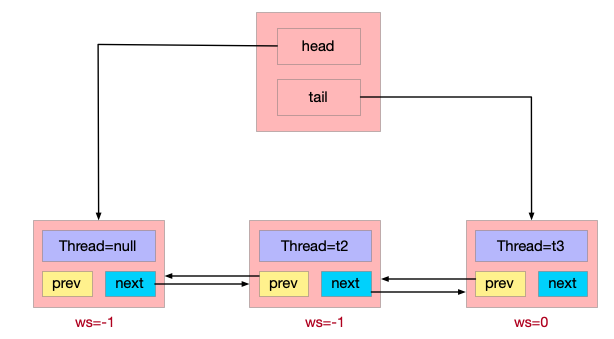

[Java中的锁及AQS实现原理](https://blog.csdn.net/TJtulong/article/details/105345940)

[美团 从ReentrantLock的实现看AQS的原理及应用](https://tech.meituan.com/2019/12/05/aqs-theory-and-apply.html)

[Java AQS底层原理解析](https://segmentfault.com/a/1190000020521611?utm_source=sf-related)

[JUC AQS ReentrantLock源码分析（一）](https://blog.csdn.net/java_lyvee/article/details/98966684)

# 自己实现一个锁

## 方法一：通过**自旋**实现一个锁

```java
public class SpinLock {
    //原子引用线程
    AtomicReference<Thread> atomicReference = new AtomicReference<>();

    public void mylock() {
        Thread thread = Thread.currentThread();
        System.out.println(Thread.currentThread().getName() + "\t come in");
        // 自旋获取锁
        while (!atomicReference.compareAndSet(null, thread)) {

        }
    }

    public void myUnlock() {
        Thread thread = Thread.currentThread();
        // CAS解锁
        atomicReference.compareAndSet(thread, null);
        System.out.println(Thread.currentThread().getName()+"\t invoked myunlock()");
    }
}
```

缺点：耗费CPU资源，没有竞争到锁的线程会一直占用CPU资源进行CAS操作。

## 方法二：改进为**park+自旋**实现锁：

Java提供了一个较为底层的并发工具类：**LockSupport**，可以让线程停止下来(**阻塞**)，还可以唤醒线程。

```java
// 阻塞线程
LockSupport.park(Object blocker) 
// 唤醒线程
LockSupport.unpark(Thread thread)
```

```java
public class SpinLock {
    // 锁状态
    volatile int status=0;
    // 阻塞线程队列
    Queue<Thread> parkQueue = new LinkedBlockingQueue<>();

    public void mylock() {
        // 自旋获取锁
        while (!compareAndSet(0,1)) { // 比较交换原子操作：当前为0则与1交换；当前为1则交换失败
            park();
        }
      lock()
      // 业务代码   
      ...
      // 解锁
      unlock()
    }

    public void myUnlock() {
        // CAS解锁
        status = 0;
        lock_notify();
    }
    
    public void park() {
      	// 把当前线程加入到等待队列
        parkQueue.add(Thread.currentThread());
        // 将当前线程释放CPU 阻塞
        LockSupport.park(Thread.currentThread());
    }
    
    public void lock_notify() {
        // 得到要唤醒的线程 头部线程
      	Thread t = parkQueue.header();
      	// 唤醒等待线程
      	unpack(t);
    }
}
```


# 公平与非公平锁

ReentrantLock的空参构造默认实现非公平锁，非公平锁在加锁时先进行了一次CAS获取锁的尝试，如果获取到锁，直接执行，不需要排队阻塞。***不过也可以调用其他构造实现公平锁。***

**非公平锁：**

```java
final void lock() {
    if (compareAndSetState(0, 1))
        setExclusiveOwnerThread(Thread.currentThread());
    else
        acquire(1);
}
```

**公平锁：**

```java
// Class FairSync
final void lock() {
    acquire(1);
}

// ---> acquire(1)来自于父类 AbstractQueuedSynchronizer
public final void acquire(int arg) {
  // 在 CAS 之前加了判断
  if (!tryAcquire(arg) && //⚠️  是 非tryAcquire(arg)
      acquireQueued(addWaiter(Node.EXCLUSIVE), arg))
    selfInterrupt();
}
```

刚释放锁的线程再次获取同步状态的几率会非常大，使得其他线程只能在同步队列中等待。

**公平性锁保证了锁的获取按照FIFO原则，而代价是进行大量的线程切换。非公平性锁虽然可能造成线程“饥饿”，但极少的线程切换，保证了其更大的吞吐量。**


# 队列同步器AQS

ReentrantLock并发机制和操作系统的PV机制原理相同。都需要一个整形的信号量，一个等待队列，以及原子性的P操作和V操作。只不过PV操作原子性由OS保证。而AQS的原子性由CAS去保证。

***队列同步器AbstractQueuedSynchronizer（AQS）是用来构建锁或者其他同步组件的基础框架，它使用了一个int成员变量表示同步状态***，通过内置的**FIFO队列**来完成资源获取线程的排队工作，并发包的作者（Doug Lea）期望它能够成为实现大部分同步需求的基础。

> ReentrantLock的lock方法调用的是Sync的lock()，而Sync继承于AbstractQueuedSynchronizer。



## FIFO队列

同步器依赖内部的同步队列（一个FIFO双向队列）来完成同步状态的管理，当前线程获取同步状态失败时，***同步器会将当前线程以及等待状态等信息构造成为一个节点（Node）并将其加入同步队列，同时会阻塞当前线程，当同步状态释放时，会把首节点中的线程唤醒，使其再次尝试获取同步状态。***



## AQS的实现

**AQS的属性：**

```java
public abstract class AbstractQueuedSynchronizer {
  // 等待队列头结点
  // 将不需要序列化的属性前添加关键字transient，序列化对象的时候，这个属性就不会被序列化
	private transient volatile Node head;
  // 等待队列尾结点
	private transient volatile Node tail;
  // 状态
	private volatile int state;
  // 当前持有锁的线程。继承于AbstractOwnableSynchronizer
  private transient Thread exclusiveOwnerThread;
}
```

**AQS中的节点Node：**

```java
static final class Node {
    // 等待状态，若值为-1，表示后继节点处于等待状态
    volatile int waitStatus;
    // 前一个节点
    volatile Node prev;
    // 下一个节点
    volatile Node next;
    // ⚠️ 节点绑定线程
    volatile Thread thread;
  	// 当前线程的状态
  	volatile int waitStatus;
}
```




### 独占锁同步状态的获取






#### **非公平锁模式：**

ReentrantLock的空参构造默认实现非公平锁

```java
// 非公平锁在加锁时先进行了一次CAS获取锁的尝试，如果获取到锁，直接执行，不需要排队阻塞
final void lock() {
    if (compareAndSetState(0, 1))
        setExclusiveOwnerThread(Thread.currentThread());
    else
        acquire(1);
}
```

#### **公平锁模式：**

##### 线程t1进入：

当第一个线程t1 进入时，队头和队尾都是null，所以`h != t` 为False，return False，不需要排队。此时如果CAS操作成功，第3步的`tryAcquire()`返回true，第2步的`acquire(1)`未进入if，正常返回。***sync.lock()正常执行完毕。***  ***⚠️ 所以交替执行的线程不会使用到队列。***

```java
//1️⃣ Class FairSync
final void lock() {
    acquire(1);
}

//2️⃣ ---> acquire(1)来自于父类 AbstractQueuedSynchronizer
public final void acquire(int arg) {
  if (!tryAcquire(arg) && //⚠️  3️⃣带回来了true，所以无须对后半条语句进行判断，该函数正常返回咯
      acquireQueued(addWaiter(Node.EXCLUSIVE), arg))
    selfInterrupt();
}

//3️⃣ tryAcquire(arg) --> 来自于AbstractQueuedSynchronizer的实现类FairSync
protected final boolean tryAcquire(int acquires) {
  final Thread current = Thread.currentThread(); // 获取当前线程
  int c = getState(); // Lock中要抢占的对象，类似于自实现锁中的 volatile int status=0;
  if (c == 0) {  // 0:自由状态/无人持有，可以抢占
    if (!hasQueuedPredecessors() &&  // 公平锁不会立刻进行CAS，还要判断自己是否需要排队 !hasQueuedPredecessors() 
        compareAndSetState(0, acquires)) { // 尝试 CAS 操作
      setExclusiveOwnerThread(current); // 如果CAS也改变成功，把当前线程设置为持锁线程
      return true; //返回2️⃣
    }
  }
  else if (current == getExclusiveOwnerThread()) {
    int nextc = c + acquires;
    if (nextc < 0)
      throw new Error("Maximum lock count exceeded");
    setState(nextc);
    return true;
  }
  return false;
}

// 4️⃣ hasQueuedPredecessors() 公平锁不会立刻进行CAS，还要判断自己是否需要排队 
public final boolean hasQueuedPredecessors() {
  // The correctness of this depends on head being initialized
  // before tail and on head.next being accurate if the current
  // thread is first in queue.
  Node t = tail; // Read fields in reverse initialization order
  Node h = head;
  Node s;
  return h != t &&
    ((s = h.next) == null || s.thread != Thread.currentThread());
}
```

##### 线程t2进入(未获得锁)：



t1线程以上锁，t2在t1未解锁时候访问同步代码；此时state已经被线程t1改为1，所以只能 return false。

> ⚠️ 一点小原则：AQS队列头部的thread永远为空！





**为什么要自旋两次，第一次ws=0,第二次ws=-1；**

ANSWER：多自旋转一次，为了尽量不让线程park()阻塞，此外ws=0是一个必要的存在，在shouldParkAfterFailedAcquire()方法中会对ws=0做一些逻辑判断，所以不能直接等于-1。（-1表示此线程处于睡眠状态）

```java
//1️⃣ Class FairSync
final void lock() {
    acquire(1);
}

//2️⃣ ---> acquire(1)来自于父类 AbstractQueuedSynchronizer
public final void acquire(int arg) {
  if (!tryAcquire(arg) && //  3️⃣带回来了false，继续判断后半条语句(是否需要入队)，->4️⃣
      acquireQueued(addWaiter(Node.EXCLUSIVE), arg)) // 6️⃣
    selfInterrupt();
}

//3️⃣ tryAcquire(arg) --> 来自于AbstractQueuedSynchronizer的实现类FairSync
protected final boolean tryAcquire(int acquires) {
  final Thread current = Thread.currentThread(); // 获取当前线程 t2
  int c = getState(); // Lock中要抢占的对象，类似于自实现锁中的 volatile int status=0;
  if (c == 0) {  // 此时c=1 执行else if
    if (!hasQueuedPredecessors() &&  
        compareAndSetState(0, acquires)) { 
      setExclusiveOwnerThread(current); 
      return true;
    }
  }
  else if (current == getExclusiveOwnerThread()) { // 判断当前线程是否和持锁线程相同，t2!=t1
    int nextc = c + acquires;
    if (nextc < 0)
      throw new Error("Maximum lock count exceeded");
    setState(nextc);
    return true;
  }
  return false; // 只能返回false咯，回到了2️⃣
}

// 4️⃣ addWaiter(Node.EXCLUSIVE), arg)
private Node addWaiter(Node mode) {
  Node node = new Node(Thread.currentThread(), mode); // 实例化一个node(双向链表)
  // Try the fast path of enq; backup to full enq on failure
  Node pred = tail; // pred = null;
  if (pred != null) { //false
    node.prev = pred;
    if (compareAndSetTail(pred, node)) {
      pred.next = node;
      return node;
    }
  }
  enq(node); // 到这咯->5️⃣
  return node; // 返回t2的node.->2️⃣
}

// 5️⃣ enq(node)
private Node enq(final Node node) {
  for (;;) { // 死循环
    Node t = tail; // t=null; //第二次循环t!=null咯，->else
    if (t == null) { // Must initialize
      if (compareAndSetHead(new Node())) // ⚠️ CAS 设置 AQS的头部(一个空的Node)！保证入队操作安全
        tail = head; // 尾部也指向这个空Node ⚠️ 注入灵魂: AQS队列头部的thread永远为空！
    } else { //第二次循环时进入
      node.prev = t; // 4️⃣中t2的node的prev指向空node，即入队
      if (compareAndSetTail(t, node)) { // AQS尾部是t就更改为node，原子操作
        t.next = node; // 空节点的next指向t2的node
        return t; // 返回队列头部节点t(空节点)->4️⃣
      }
    }
  }
}

// 6️⃣ acquireQueued(addWaiter(Node.EXCLUSIVE), arg))
final boolean acquireQueued(final Node node, int arg) {
  boolean failed = true; 
  try {
    boolean interrupted = false; // ReentrantLock 可以被打断
    for (;;) { // ⚠️ 死循环
      final Node p = node.predecessor();
      if (p == head && tryAcquire(arg)) { // ⚠️ 判断自己是不是第一个排队的(不是指头部)，是的话尝试获得锁 // 第二次循环 判断头部+再次自旋
        setHead(node);
        p.next = null; // help GC
        failed = false;
        return interrupted;
      }
      if (shouldParkAfterFailedAcquire(p, node) &&  // t2自旋失败来到这, -> 7️⃣ // 第二次循环前半部分为true，执行parkAndCheckInterrupt() -> 8️⃣
          parkAndCheckInterrupt())
        interrupted = true;
    }
  } finally {
    if (failed)
      cancelAcquire(node); // 失败 取消获得锁
  }
}

// 7️⃣ shouldParkAfterFailedAcquire()在获取锁失败后是否需要park
private static boolean shouldParkAfterFailedAcquire(Node pred, Node node) {
  int ws = pred.waitStatus; // ws=0 //第二次循环。 ws=-1
  if (ws == Node.SIGNAL) // Node.SIGNAL为-1
    return true; // 第二次循环 返回6️⃣true
  if (ws > 0) {
    do {
      node.prev = pred = pred.prev;
    } while (pred.waitStatus > 0);
    pred.next = node;
  } else {
    compareAndSetWaitStatus(pred, ws, Node.SIGNAL); // 把上一个节点null的 ws属性改为-1
  }
  return false; // 返回6️⃣
}

// 8️⃣
private final boolean parkAndCheckInterrupt() {
  LockSupport.park(this); // this是当前线程，阻塞t2
  return Thread.interrupted();
}
```


##### 线程t2进入(获得锁)：



```java
//1️⃣ Class FairSync
final void lock() {
    acquire(1);
}

//2️⃣ ---> acquire(1)来自于父类 AbstractQueuedSynchronizer
public final void acquire(int arg) {
  if (!tryAcquire(arg) && //  3️⃣(队列未初始化true，正常返回)
      acquireQueued(addWaiter(Node.EXCLUSIVE), arg)) 
    selfInterrupt();
}

//3️⃣ tryAcquire(arg) --> 来自于AbstractQueuedSynchronizer的实现类FairSync
protected final boolean tryAcquire(int acquires) {
  final Thread current = Thread.currentThread(); // 获取当前线程 t2
  int c = getState(); // Lock中要抢占的对象，类似于自实现锁中的 volatile int status=0;
  if (c == 0) {  // 此时c=0,进入循环
    if (!hasQueuedPredecessors() &&  // 判断t2是否需要排队->4️⃣（未初始化返回flase，继续判断）
        compareAndSetState(0, acquires)) { // CAS加锁
      setExclusiveOwnerThread(current); // 设置t2为持锁线程
      return true; //->2️⃣
    }
  }
  else if (current == getExclusiveOwnerThread()) { // 队列初始化完毕执行这段
    int nextc = c + acquires;
    if (nextc < 0)
      throw new Error("Maximum lock count exceeded");
    setState(nextc);
    return true;
  }
  return false; 
}

// 4️⃣ hasQueuedPredecessors() 
public final boolean hasQueuedPredecessors() {
  // The correctness of this depends on head being initialized
  // before tail and on head.next being accurate if the current
  // thread is first in queue.
  Node t = tail; // Read fields in reverse initialization order
  Node h = head;
  Node s;
  return h != t &&  // 未初始化 h=t=null,返回false；队列元素>1,true;队列元素=1
    ((s = h.next) == null || s.thread != Thread.currentThread()); //二号节点==null||二号节点的线程!=当前线程t2（是不是第一个排队的人来问，是的话就CAS加锁咯；在调用该方法的前提就是锁处于自由状态）
}

```


##### 线程t3进入(未获得锁)：



```java
//1️⃣ Class FairSync
final void lock() {
    acquire(1);
}

//2️⃣ ---> acquire(1)来自于父类 AbstractQueuedSynchronizer
public final void acquire(int arg) {
  if (!tryAcquire(arg) && //  3️⃣带回来了false，继续判断后半条语句(是否需要入队)，->4️⃣
      acquireQueued(addWaiter(Node.EXCLUSIVE), arg)) // 5️⃣
    selfInterrupt();
}

//3️⃣ tryAcquire(arg) --> 来自于AbstractQueuedSynchronizer的实现类FairSync
protected final boolean tryAcquire(int acquires) {
  final Thread current = Thread.currentThread(); // 获取当前线程 t2
  int c = getState(); // Lock中要抢占的对象，类似于自实现锁中的 volatile int status=0;
  if (c == 0) {  // 此时c=1 执行else if
    if (!hasQueuedPredecessors() &&  
        compareAndSetState(0, acquires)) { 
      setExclusiveOwnerThread(current); 
      return true;
    }
  }
  else if (current == getExclusiveOwnerThread()) { // 判断当前线程是否和持锁线程相同，t2!=t1
    int nextc = c + acquires;
    if (nextc < 0)
      throw new Error("Maximum lock count exceeded");
    setState(nextc);
    return true;
  }
  return false; // 只能返回false咯，回到了2️⃣
}

// 4️⃣ addWaiter(Node.EXCLUSIVE), arg)
private Node addWaiter(Node mode) {
  Node node = new Node(Thread.currentThread(), mode); // 实例化一个t3的node(双向链表)
  // Try the fast path of enq; backup to full enq on failure
  Node pred = tail; // pred = t2 node;
  if (pred != null) { // true
    node.prev = pred; // t3的prev指向t2
    if (compareAndSetTail(pred, node)) { // CAS 尝试t3入队
      pred.next = node; // t2的next指向t2node
      return node; // 返回 2️⃣
    }
  }
  enq(node); 
  return node; 
}

// 5️⃣ acquireQueued(addWaiter(Node.EXCLUSIVE), arg))
final boolean acquireQueued(final Node node, int arg) {
  boolean failed = true; 
  try {
    boolean interrupted = false; 
    for (;;) { // ⚠️ 死循环
      final Node p = node.predecessor(); // p = t2 node
      if (p == head && tryAcquire(arg)) {  // t2 node != head；不是第一个排队的就直接去乖乖排队吧
        setHead(node);
        p.next = null; // help GC
        failed = false;
        return interrupted;
      }
      if (shouldParkAfterFailedAcquire(p, node) &&  // 到这
          parkAndCheckInterrupt())
        interrupted = true;
    }
  } finally {
    if (failed)
      cancelAcquire(node); 
  }
}

// 6️⃣ shouldParkAfterFailedAcquire()在获取锁失败后是否需要park
private static boolean shouldParkAfterFailedAcquire(Node pred, Node node) {
  int ws = pred.waitStatus; //⚠️ ws拿的是前一个node t2的waitStatus！
  if (ws == Node.SIGNAL) // ws=0 执行else
    return true; 
  if (ws > 0) {
    do {
      node.prev = pred = pred.prev;
    } while (pred.waitStatus > 0);
    pred.next = node;
  } else { 
    compareAndSetWaitStatus(pred, ws, Node.SIGNAL); // 把t2的ws改为-1
  }
  return false; // 
}

// 7️⃣ 
private final boolean parkAndCheckInterrupt() {
  LockSupport.park(this); 
  return Thread.interrupted();
}
```

为什么不把自己的ws改为-1，而是修改上一个节点的ws。

ANSWER：因为阻塞了没办法修改自己；如果加在阻塞的上方，万一出现异常，阻塞就不会正常进行了，就不统一了。还有一个原因是当前线程ws=0在解锁过程有作用。


1️⃣2️⃣3️⃣4️⃣5️⃣6️⃣7️⃣8️⃣9️⃣🔟

# 重入锁ReentrantLock

**重入锁ReentrantLock**，顾名思义，就是支持重进入的锁，它表示该锁能够支持一个线程对资源的重复加锁。

可重入锁（也叫作递归锁），指的时同一线程外层函数获得锁之后，内层递归函数仍然能获取该锁的代码，在同一个线程在外层方法获取锁的时候，在进入内层方法会自动获取锁，也就是说，**线程可以进入任何一个它已经拥有的锁所同步着的代码块**。可重入锁最大的作用是**避免死锁**。

可重入锁主要解决了两个问题：

- 线程再次获取锁。锁需要去识别获取锁的线程是否为当前占据锁的线程，如果是，则再次成功获取。
- 锁的最终释放。线程重复n次获取了锁，随后在第n次释放该锁后，其他线程能够获取到该锁。锁的最终释放要求锁对于获取进行**计数自增**，计数表示当前锁被重复获取的次数，而锁被释放时，**计数自减**，当计数等于0时表示锁已经成功释放。

```java
//3️⃣ tryAcquire(arg) --> 来自于AbstractQueuedSynchronizer的实现类FairSync
protected final boolean tryAcquire(int acquires) {
  final Thread current = Thread.currentThread(); // 获取当前线程 t2
  int c = getState(); // Lock中要抢占的对象，类似于自实现锁中的 volatile int status=0;
  if (c == 0) {  // 此时c=1 执行else if
    if (!hasQueuedPredecessors() &&  
        compareAndSetState(0, acquires)) { 
      setExclusiveOwnerThread(current); 
      return true;
    }
  }
  // ⚠️⚠️⚠️ ReentrantLock 锁重入的实现！
  else if (current == getExclusiveOwnerThread()) { // 判断当前线程是否和持锁线程相同
    int nextc = c + acquires; // 如果是同一个线程，计数器变量+1；示当前锁被重复获取的次数
    if (nextc < 0)
      throw new Error("Maximum lock count exceeded");
    setState(nextc); // 设置锁的计数器
    return true;
  }
  return false;
}

// ReentrantLock.unlock() 调用了Sync中的tryRelease
protected final boolean tryRelease(int releases) {
  int c = getState() - releases; // 计数器 -1；锁被释放时，计数自减，当计数等于0时表示锁已经成功释放。
  if (Thread.currentThread() != getExclusiveOwnerThread())
    throw new IllegalMonitorStateException();
  boolean free = false;
  if (c == 0) {
    free = true;
    setExclusiveOwnerThread(null);
  }
  setState(c);
  return free;
}
```


# 读写锁

**写锁是独占的**，当写锁被获取到时，后续（非当前写操作线程）的读写操作都会被阻塞，写锁释放之后，所有操作继续执行。

**读锁是共享的**，多个线程可以共同读取数据。

一般情况下，读写锁的性能都会比排它锁好，因为大多数场景读是多于写的。在读多于写的情况下，读写锁能够提供比排它锁更好的并发性和吞吐量。Java并发包提供读写锁的实现是**ReentrantReadWriteLock**。

## **读写锁的实现原理：**

读写锁同样依赖自定义同步器来实现同步功能，而读写状态就是其同步器的同步状态。读写锁的自定义同步器需要在同步状态（一个整型变量）上维护多个读线程和一个写线程的状态。

如果在一个整型变量上维护多种状态，就一定需要**按位切割使用**这个变量，读写锁将变量切分成了两个部分，**高16位表示读，低16位表示写**，划分方式如图（当前同步状态表示一个线程已经获取了写锁，且重进入了两次，同时也连续获取了两次读锁）：


**写锁是一个支持重进入的排它锁**。如果当前线程已经获取了写锁，则增加写状态。如果当前线程在获取写锁时，读锁已经被获取（读状态不为0）或者该线程不是已经获取写锁的线程，则当前线程进入等待状态。

**读锁是一个支持重进入的共享锁**，它能够被多个线程同时获取，在没有其他写线程访问（或者写状态为0）时，读锁总会被成功地获取，而所做的也只是（线程安全的）增加读状态。

