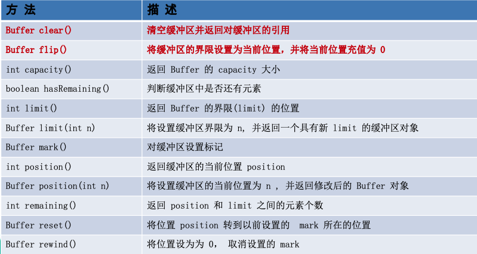

# Java NIO 简介

Java NIO(New IO)是从Java 1.4版本开始引入的一个新的IO API，可以替代标准的Java IO API。 NIO与原来的IO有同样的作用和目的，但是使用的方式完全不同，NIO支持面向缓冲区的、基于通道的IO操作。NIO将以更加高效的方式进行文件的读写操作。

1. Java NIO 全称java non一blocking IO，是指JDK提供的新API。从JDK1.4开始，Java提供了一系列改进的输入/输出的新特性，被统称为NIO（即 New IO），是同步非阻塞的
2. NIO相关类都被放在java.nio包及子包下，并且对原 java.io包中的很多类进行改写。
3. NIO是面向缓冲区，或者面向块编程的。数据读取到一个它稍后处理的缓冲区，需要时可在缓冲区中前后移动，这就增加了处理过程中的灵活性，使用它可以提供非阻塞式的高伸缩性网络
4. Java NIO 的非阻塞模式，使一个线程从某通道发送请求或者读取数据，但是它仅能得到目前可用的数据，如果目前没有数据可用时，就什么都不会获取，而不是保持线程阻塞，所以直至数据变的可以读取之前，该线程可以继续做其他的事情。非阻塞写也是如此，一个线程请求写入一些数据到某通道，但不需要等待它完全写入，这个线程同时可以去做别的事情。
5. 通俗理解:NIO是可以做到用一个线程来处理多个操作的。假设有10000个请求过来，根据实际情况，可以分配50或者100个线程来处理。不像之前的阻塞IO那样，非得分配10000个。
6. **HTTP2.0使用了多路复用的技术，做到同一个连接并发处理多个请求，而且并发请求的数量比HTTP1.1大了好几个数量级**
7. NIO有三大核心部分:**Channel（通道），Buffer（缓冲区）， Selector（选择器）**
   - 每个 channel 都会对应一个 Buffer
   - Selector 对应一个线程，一个线程对应多个 channel（连接）
   - 该图反应了有三个channel注册到该selector //程序
   - 程序切换到哪个channel 是由事件决定的， **Event** 就是一个重要的概念
   - Selector 会根据不同的事件，在各个通道上切换
   - Buffer 就是一个内存块，底层维护了一个数组
   - 数据的读取写入是通过 Buffer，这个和BIO， BIO 中要么是输入流，或者是输出流，不能双向，但是NIO的 Buffer 是可以读也可以写，**需要flip方法切换**
   - channel是双向的，可以返回底层操作系统的情况，比如 Linux，底层的操作系统通道就是双向的


# Java NIO 与 IO 的主要区别

1）BIO以流的方式处理数据，而NIO以块的方式处理数据，块I/O的效率比流I/O 高很多

2）BIO是阻塞的，NIO则是非阻塞的

3）BIO 基于字节流和字符流进行操作，而NIO基于Channel（通道）和 Buffer（缓冲区）进行操作，数据总是从通道读取到缓冲区中，或者从缓冲区写入到通道中。Selector（选择器）用于监听多个通道的事件（比如:连接请求，数据到达等），因此使用**单个线程就可以监听多个客户端通道**

| IO                      | NIO                         |
| ----------------------- | --------------------------- |
| 面向流(Stream Oriented) | 面向缓冲区(Buffer Oriented) |
| 阻塞IO(Blocking IO)     | 非阻塞IO(Non Blocking IO)   |
| (无)                    | 选择器(Selectors)           |

# 缓冲区(Buffer)和通道(Channel)

Java NIO系统的核心在于:通道(Channel)和缓冲区(Buffer)。通道表示打开到 IO 设备(例如:文件、 套接字)的连接。若需要使用 NIO 系统，需要获取用于连接 IO 设备的通道以及用于容纳数据的缓冲区。然后操作缓冲区，对数据进行处理。

***简而言之，Channel 负责传输， Buffer 负责存储***

## 缓冲区(**Buffer**)

缓冲区 （Buffer）:缓冲区本质上是一个**可以读写数据的内存块**，可以理解成是一个**容器对象（含数组）**，该对象提供了一组方法，可以更轻松地使用内存块，缓冲区对象内置了一些机制，能够跟踪和记录缓冲区的状态变化情况。Channel提供从文件、网络读取数据的渠道，但是读取或写入的数据都必须经由 Buffer。


- 一个用于特定基本数据类型的容器。由 java.nio 包定义的，所有缓冲区 都是 Buffer 抽象类的子类。

- Java NIO 中的 Buffer 主要用于与 NIO 通道进行 交互，数据是从通道读入缓冲区，从缓冲区写入通道中的。
- Buffer 就像一个数组，可以保存多个相同类型的数据。根据数据类型不同(boolean 除外) ，有以下 Buffer 常用子类:
  - ByteBuffer
  - CharBuffer
  - ShortBuffer 
  - IntBuffer
  - LongBuffer 
  - FloatBuffer 
  - DoubleBuffer
- 上述 Buffer 类他们都采用相似的方法进行管理数据，只是各自管理的数据类型不同而已。都是通过如下方法获取一个 Buffer对象:
  - `static XxxBuffer allocate(int capacity)` : 创建一个容量为 capacity 的 XxxBuffer 对象

### 缓冲区的基本属性

- 容量 **(capacity)** :***表示 Buffer 最大数据容量***，缓冲区容量不能为负，并且创建后不能更改。
- 限制 **(limit)**:第一个不应该读取或写入的数据的索引，***即位于 limit 后的数据不可读写***。缓冲区的限制不能为负，并且不能大于其容量。
- 位置 **(position)**:***下一个要读取或写入的数据的索引。***缓冲区的位置不能为负，并且不能大于其限制
- 标记 **(mark)**与重置 **(reset)**:标记，表示记录当前position的位置。之后可以通过调用 reset() 方法恢复到这个position.
- 标记、位置、限制、容量遵守以下不变式:**0<=mark<=position<=limit<=capacity**


### Buffer的常用方法

⚠️rewind 与 flip 都会把 position 设置为 0，且都会丢弃 mark 值（其实是设置为 -1），但不同点在于：

1. ***flip 会改变 limit 的值，一般会设置为当前的读写位置***；
2. rewind 不会改变 limit 的值，一般会设置为 capacity 的值；



### 缓冲区的数据操作

Buffer 所有子类提供了两个用于数据操作的方法:get() 与 put() 方法

- 获取 **Buffer** 中的数据
  - get() :读取单个字节
  - get(byte[] dst):批量读取多个字节到 dst 中
  - get(int index):读取指定索引位置的字节(不会移动 position)
- 放入数据到 **Buffer** 中
  - put(byte b):将给定单个字节写入缓冲区的当前位置
  - put(byte[] src):将 src 中的字节写入缓冲区的当前位置 
  - put(int index, byte b):将指定字节写入缓冲区的索引位置(不会移动 position)


### 直接与非直接缓冲区

非直接缓冲区：通过allocate()方法分配缓冲区，将缓冲区建立在JVM的内存中


直接缓冲区：通过allocateDirect()方法分配直接缓冲区，将缓冲区建立在操作系统的物理内存中。可以提高效率。


- 字节缓冲区要么是直接的，要么是非直接的。如果为直接字节缓冲区，则**Java**虚拟机会尽最大努力直接在此缓冲区上执行本机 **I/O** 操作。也就是说，***在每次调用基础操作系统的一个本机 I/O 操作之前(或之后)， 虚拟机都会尽量避免将缓冲区的内容复制到中间缓冲区中(或从中间缓冲区中复制内容)。***
- ***直接字节缓冲区可以通过调用此类的allocateDirect()工厂方法来创建。***此方法返回的缓冲区进行分配和取消分配所需成本通常高于非直接缓冲区。***直接缓冲区的内容可以驻留在常规的垃圾回收堆之外***，因此，它们对应用程序的内存需求量造成的影响可能并不明显。所以，建议将直接缓冲区主要分配给那些易受基础系统的本机 **I/O** 操作影响的大型、持久的缓冲区。⚠️***一般情况下，最好仅在直接缓冲区能在程序性能方面带来明显好 处时分配它们。***
- ***直接字节缓冲区还可以通过FileChannel的map()方法将文件区域直接映射到内存中来创建。***该方法返回 **MappedByteBuffer**。**Java** 平台的实现有助于通过 **JNI** 从本机代码创建直接字节缓冲区。如果以上这些缓冲区中的某个缓冲区实例指的是不可访问的内存区域，则试图访问该区域不会更改该缓冲区的内容，并且将会在访问期间或稍后的某个时间导致抛出不确定的异常。
- 字节缓冲区是直接缓冲区还是非直接缓冲区可通过调用其**isDirect()**方法来确定。提供此方法是为了能够在性能关键型代码中执行显式缓冲区管理。

## 通道(Channel)

通道(Channel):由 java.nio.channels 包定义的，用于源节点和目标节点的连接，在Java NIO中负责缓冲区数据的传输。 ***Channel 类似于传统的“流”。***但有些区别如下:

- 只不过 Channel 本身不存储数据，Channel 只能与 Buffer 进行交互
- 通道可以同时进行读写，而流只能读或者只能写
- 通道可以实现**异步读写数据**
- 通道可以从缓冲读数据，也可以写数据到缓冲:


1. 读写请求非常大时，会建立非常多的DMA(Direct Memory Access)总线导致总线冲突。


2. 通道是一个完全独立的处理器，专门用于IO操作，拥有自己的指令。CPU资源利用率更高。


Java 为 Channel 接口提供的最主要实现类如下:

- **FileChannel**:用于读取、写入、映射和操作文件的通道，不能切换为非阻塞模式。
- **DatagramChannel**:通过 UDP 读写网络中的数据通道。 
- **SocketChannel**:通过 TCP 读写网络中的数据。 
- **ServerSocketChannel**:可以监听新进来的 TCP 连接，对每一个新进来的连接都会创建一个 SocketChannel。

### 获取通道

获取通道的一种方式是对支持通道的对象调用 `getChannel()` 方法。支持通道的类如下:

- 本地IO：
  - FileInputStream / FileOutputStream 

    ```java
    // FileInputStream / FileOutputStream 
    fileInputStream = new FileInputStream("src/main/java/com/rin/pic/1.txt");
    inChannel = fileInputStream.getChannel();// 获取通道
    ```

  - RandomAccessFile 

    ```java
    // RandomAccessFile 
    RandomAccessFile raf1 = new RandomAccessFile("src/main/java/com/rin/pic/1.txt","rw");
    FileChannel channel1 = raf1.getChannel(); // 获取通道
    ```

- 网络IO：

  - DatagramSocket
  - Socket
  - ServerSocket

***在JDK1.7中的NIO.2中提供了另外两种获取通道的方法：***

- 使用 Files 类的静态方法 `newByteChannel()` 获取字节通道

- 通过通道的静态方法 `open() `打开并返回指定通道。

  ```java
  // 通过通道的静态方法 open() 打开并返回指定通道。
  // Paths.get("src/main/java/com/rin/pic/1.txt") 也可用拼串的方式
  inChannel = FileChannel.open(Paths.get("src/main/java/com/rin/pic", "1.txt"), StandardOpenOption.READ);
  // StandardOpenOption.CREATE_NEW 要写的文件不存在就创建，已经存在则报错
  outChannel = FileChannel.open(Paths.get("src/main/java/com/rin/pic", "3.txt"), StandardOpenOption.WRITE, StandardOpenOption.READ, StandardOpenOption.CREATE_NEW);
  ```

### 通道的数据传输

#### 文件通道(FileChannel)的常用方法


将 Buffer 中数据写入 Channel:

```java
int bytesWritten = inChannel.write(buf);
```

从 Channel 读取数据到 Buffer:

```java
int bytesRead = inChannel.read(buf);
```

**案例一：本地文件写数据，使用ByteBuffer（缓冲）和 FileChannel（通道），将"Silince"写入到file01.txt中**


```java
String str = "Siline";
//创建一个输出流->channel
FileOutputStream fileOutputStream = new FileOutputStream("file01.txt");

//通过 fileOutputStream 获取 对应的 FileChannel(即fileOutputStream内置了FileChannel)
//这个 fileChannel 真实类型是  FileChannelImpl
FileChannel fileChannel = fileOutputStream.getChannel();

//创建一个缓冲区 ByteBuffer
ByteBuffer byteBuffer = ByteBuffer.allocate(1024);

//将 str 放入 byteBuffer
byteBuffer.put(str.getBytes());

//写->读，需要对byteBuffer 进行flip 
byteBuffer.flip();

//将byteBuffer 数据写入到 fileChannel
fileChannel.write(byteBuffer);
fileOutputStream.close();
```


**案例二：本地文件读数据，使用ByteBuffer（缓冲）和 FileChannel（通道），将file01.txt中的数据读入到程序，并显示在控制台屏幕**

```java
//创建文件的输入流
File file = new File("file01.txt");
FileInputStream fileInputStream = new FileInputStream(file);

//通过fileInputStream 获取对应的FileChannel -> 实际类型  FileChannelImpl
FileChannel fileChannel = fileInputStream.getChannel();

//创建缓冲区
ByteBuffer byteBuffer = ByteBuffer.allocate((int) file.length());

//将 通道的数据读入到Buffer
fileChannel.read(byteBuffer);

//将byteBuffer 的 字节数据 转成String
System.out.println(new String(byteBuffer.array()));
fileInputStream.close();
```


**案例三：使用一个Buffer完成文件读取, 即使用FileChannel（通道）和方法read/write，完成文件的拷贝:**


```java
FileInputStream fileInputStream = new FileInputStream("1.txt");
FileChannel fileChannel01 = fileInputStream.getChannel();

FileOutputStream fileOutputStream = new FileOutputStream("2.txt");
FileChannel fileChannel02 = fileOutputStream.getChannel();

ByteBuffer byteBuffer = ByteBuffer.allocate(512);

while (true) { //循环读取

  //这里有一个重要的操作，一定不要忘了
  byteBuffer.clear(); //清空buffer,重制标志位
  int read = fileChannel01.read(byteBuffer);
  System.out.println("read =" + read);
  if(read == -1) { //表示读完
    break;
  }
  //将buffer 中的数据写入到 fileChannel02 -- 2.txt
  byteBuffer.flip();
  fileChannel02.write(byteBuffer);
}

//关闭相关的流
fileInputStream.close();
fileOutputStream.close();
```


**案例四：将数据从源通道传输到其他 Channel 中:**

```java
public void test3(){
    FileChannel inChannel = null;
    FileChannel outChannel = null;
    try {
        // Paths.get("src/main/java/com/rin/pic/1.txt") 也可用拼串的方式
        inChannel = FileChannel.open(Paths.get("src/main/java/com/rin/pic", "1.txt"), StandardOpenOption.READ);
        // StandardOpenOption.CREATE_NEW 要写的文件不存在就创建，已经存在则报错
        outChannel = FileChannel.open(Paths.get("src/main/java/com/rin/pic", "4.txt"), StandardOpenOption.WRITE, StandardOpenOption.READ, StandardOpenOption.CREATE_NEW);

        // transferTo()写法
        inChannel.transferTo(0,inChannel.size(),outChannel);
        // transferFrom()写法
        // outChannel.transferFrom(inChannel,0,inChannel.size());

    } catch (IOException e) {
        e.printStackTrace();
    } finally {
        if (inChannel != null) {
            try {
                inChannel.close();
            } catch (IOException e) {
                e.printStackTrace();
            }
        }
        if (outChannel != null) {
            try {
                outChannel.close();
            } catch (IOException e) {
                e.printStackTrace();
            }
        }
    }
}
```

### 分散和聚集

分散读取(Scattering Reads)是指将 Channel 中读取的数据“分散”到多个 Buffer 中。

***注意：按照缓冲区的顺序，从 Channel 中读取的数据依次将 Buffer 填满。***


聚集写入(Gathering Writes)是指将多个 Buffer 中的数据“聚集” 到 Channel。

***注意：按照缓冲区的顺序，写入 position 和 limit 之间的数据到 Channel 。***


```java
public void test1() throws IOException {
  RandomAccessFile raf1 = new RandomAccessFile("src/main/java/com/rin/pic/1.txt","rw");
  // 获取通道
  FileChannel channel1 = raf1.getChannel();
  // 分配指定大小的缓冲区
  ByteBuffer buf1 = ByteBuffer.allocate(100);
  ByteBuffer buf2 = ByteBuffer.allocate(1024);

  // 分散读取
  ByteBuffer[] bufs = {buf1,buf2};
  channel1.read(bufs);

  for (ByteBuffer buf : bufs) {
    buf.flip();
  }
  System.out.println(new String(bufs[0].array(),0,bufs[0].limit()));
  System.out.println("-----------------");
  System.out.println(new String(bufs[1].array(),0,bufs[1].limit()));

  // 聚集写入
  RandomAccessFile raf2 = new RandomAccessFile("src/main/java/com/rin/pic/2.txt","rw");
  FileChannel channel2 = raf2.getChannel();
  channel2.write(bufs);
}
```


## Buffer 和 Channel的注意事项

1）ByteBuffer 支持类型化的put 和 get， put 放入的是什么数据类型，get 就应该使用相应的数据类型来取出，否则可能有 BufferUnderflowException异常。

```java
//创建一个Buffer
ByteBuffer buffer = ByteBuffer.allocate(64);

//类型化方式放入数据
buffer.putInt(100);
buffer.putLong(9);
buffer.putChar('张');
buffer.putShort((short) 4);

//取出
buffer.flip();

System.out.println();
System.out.println(buffer.getInt());
System.out.println(buffer.getLong());
System.out.println(buffer.getChar());
System.out.println(buffer.getShort());
```

2）可以将一个普通 Buffer 转成只读 Buffer

```java
//创建一个buffer
ByteBuffer buffer = ByteBuffer.allocate(64);

for(int i = 0; i < 64; i++) {
  buffer.put((byte)i);
}

//读取
buffer.flip();

//得到一个只读的Buffer
ByteBuffer readOnlyBuffer = buffer.asReadOnlyBuffer();
System.out.println(readOnlyBuffer.getClass());

//读取
while (readOnlyBuffer.hasRemaining()) {
  System.out.println(readOnlyBuffer.get());
}

readOnlyBuffer.put((byte)100); //ReadOnlyBufferException
```

3）NIO还提供了MappedByteBuffer，**可以让文件直接在内存（堆外的内存）中进行修改**，而如何同步到文件由 NIO 来完成

```java
// MappedByteBuffer 可让文件直接在内存(堆外内存)修改, 操作系统不需要拷贝一次
RandomAccessFile randomAccessFile = new RandomAccessFile("1.txt", "rw");
//获取对应的通道
FileChannel channel = randomAccessFile.getChannel();

/**
  * 参数1: FileChannel.MapMode.READ_WRITE 使用的读写模式
  * 参数2： 0 ： 可以直接修改的起始位置
  * 参数3:  5: 是映射到内存的大小(不是索引位置) ,即将 1.txt 的多少个字节映射到内存
  * 可以直接修改的范围就是 0-5
  * 实际类型 DirectByteBuffer
  */
MappedByteBuffer mappedByteBuffer = channel.map(FileChannel.MapMode.READ_WRITE, 0, 5);

mappedByteBuffer.put(0, (byte) 'H');
mappedByteBuffer.put(3, (byte) '9');
mappedByteBuffer.put(5, (byte) 'Y');//IndexOutOfBoundsException

randomAccessFile.close();
System.out.println("修改成功~~");
```

4）前面我们讲的读写操作，都是通过一个Buffer 完成的，**NIO还支持通过多个Buffer （即Buffer 数组）完成读写操作**，即分散和聚集

```java
/**
 * Scattering：将数据写入到buffer时，可以采用buffer数组，依次写入  [分散]
 * Gathering: 从buffer读取数据时，可以采用buffer数组，依次读
 */
public class ScatteringAndGatheringTest {
  public static void main(String[] args) throws Exception {

    //使用 ServerSocketChannel 和 SocketChannel 网络
    ServerSocketChannel serverSocketChannel = ServerSocketChannel.open();
    InetSocketAddress inetSocketAddress = new InetSocketAddress(7000);

    //绑定端口到socket ，并启动
    serverSocketChannel.socket().bind(inetSocketAddress);

    //创建buffer数组
    ByteBuffer[] byteBuffers = new ByteBuffer[2];
    byteBuffers[0] = ByteBuffer.allocate(5);
    byteBuffers[1] = ByteBuffer.allocate(2);

    //等客户端连接(telnet)
    SocketChannel socketChannel = serverSocketChannel.accept();
    int messageLength = 7;   //假定从客户端接收7个字节
    //循环的读取
    while (true) {

      int byteRead = 0;

      while (byteRead < messageLength ) {
        long l = socketChannel.read(byteBuffers);
        byteRead += l; //累计读取的字节数
        System.out.println("byteRead=" + byteRead);
        //使用流打印, 看看当前的这个buffer的position 和 limit
        Arrays.asList(byteBuffers).stream().map(buffer -> "postion=" + buffer.position() + ", limit=" + buffer.limit()).forEach(System.out::println);
      }

      //将所有的buffer进行flip
      Arrays.asList(byteBuffers).forEach(buffer -> buffer.flip());

      //将数据读出显示到客户端
      long byteWirte = 0;
      while (byteWirte < messageLength) {
        long l = socketChannel.write(byteBuffers); //
        byteWirte += l;
      }

      //将所有的buffer 进行clear
      Arrays.asList(byteBuffers).forEach(buffer-> {
        buffer.clear();
      });

      System.out.println("byteRead:=" + byteRead + " byteWrite=" + byteWirte + ", messagelength" + messageLength);
    }
  }
}
```

测试：

- `telnet 127.0.0.1 7000` `send Silince `

```java
// 测试结果
byteRead=7
postion=5, limit=5
postion=2, limit=2
byteRead:=7 byteWrite=7, messagelength7
```


# NIO 的非阻塞式网络通信

## 阻塞与非阻塞

***传统的 IO 流都是阻塞式的。******也就是说，当一个线程调用 read() 或 write() 时，该线程被阻塞，直到有一些数据被读取或写入，该线程在此期间不能执行其他任务。***因此，在完成网络通信进行 IO 操作时，由于线程会阻塞，所以服务器端必须为每个客户端都提供一个独立的线程进行处理， 当服务器端需要处理大量客户端时，性能急剧下降。

***Java NIO 是非阻塞模式的。当线程从某通道进行读写数据时，若没有数据可用时，该线程可以进行其他任务。***线程通常将非阻塞 IO 的空闲时间用于在其他通道上执行 IO 操作，所以单独的线程可以管理多个输入和输出通道。***因此，NIO 可以让服务器端使用一个或有限几个线程来同时处理连接到服务器端的所有客户端。***


## 选择器

***选择器(Selector) 是 SelectableChannle 对象的多路复用器，Selector 可 以同时监控多个 SelectableChannel 的 IO 状况，也就是说，利用 Selector 可使一个单独的线程管理多个 Channel。Selector 是非阻塞 IO 的核心。***

- Java的NIO，用非阻塞的IO方式。可以用一个线程，处理多个的客户端连接，就会使用到 **Selector（选择器）**
- **Selector能够检测多个注册的通道上是否有事件发生（注意:多个Channel以事件的方式可以注册到同一个Selector）**，如果有事件发生，便获取事件然后针对每个事件进行相应的处理。这样就可以只用一个单线程去管理多个通道，也就是管理多个连接和请求。
- 只有在连接/通道真正有读写事件发生时，才会进行读写，就大大地减少了系统开销，并且不必为每个连接都创建一个线程，不用去维护多个线程
- 避免了多线程之间的上下文切换导致的开销

SelectableChannle 的结构如下图:


### 选择器特点说明

- Netty 的IO线程NioEventLoop聚合了Selector（选择器，也叫多路复用器），可以同时并发处理成百上千个客户端连接。
- 当线程从某客户端Socket通道进行读写数据时，若没有数据可用时，该线程可以进行其他任务。
- 线程通常将非阻塞IO的空闲时间用于在其他通道上执行IO操作，所以单独的线程可以管理多个输入和输出通道。
- 由于读写操作都是非阻塞的，这就可以充分提升 IO线程的运行效率，避免由于频繁I/O阻塞导致的线程挂起。
- 一个I/O线程可以并发处理N个客户端连接和读写操作，这从根本上解决了传统同步阻塞I/O一连接一线程模型，架构的性能、弹性伸缩能力和可靠性都得到了极大的提升。


### 选择器的使用

1.创建 Selector :通过调用 Selector.open() 方法创建一个 Selector。

```java
Selector selector = Selector.open();
```

2.向选择器注册通道:SelectableChannel.register(Selector sel,int ops)

```java
ssChannel.register(selector, SelectionKey.OP_ACCEPT);
```

3.当调用 register(Selector sel, int ops) 将通道注册选择器时，选择器对通道的监听事件，需要通过第二个参数 ops 指定。 

4.可以监听的事件类型(可使用 **SelectionKey** 的四个常量表示):

- 读 : SelectionKey.OP_READ
- 写 : SelectionKey.OP_WRITE 
- 连接:SelectionKey.OP_CONNECT 
- 接收 : SelectionKey.OP_ACCEPT 

5.若注册时不止监听一个事件，则可以使用“位或”操作符连接。

```java
// 注册 监听事件
int interestSet = SelectionKey.OP_READ|SelectionKey.OP_WRITE;
```

### 选择键 SelectionKey

SelectionKey:表示 SelectableChannel 和 Selector 之间的注册关系。每次向选择器注册通道时就会选择一个事件(选择键)。选择键包含两个表示为整数值的操作集。操作集的每一位都表示该键的通道所支持的一类可选择操作。

可以监听的事件类型(可使用 **SelectionKey** 的四个常量表示):

- 读 : SelectionKey.OP_READ
- 写 : SelectionKey.OP_WRITE 
- 连接:SelectionKey.OP_CONNECT 
- 接收 : SelectionKey.OP_ACCEPT 


### 选择器Selector常用方法


### ServerSocketChannel常用方法

| 方法                                                     | 描述                                              |
| -------------------------------------------------------- | ------------------------------------------------- |
| static ServeSocketChannel open()                         | 得到一个ServerSocketChannel通道                   |
| final ServerSocketChannel bind(SocketAddress local)      | 设置服务器端口号                                  |
| final SelectableChannel configureBlocking(boolean block) | 设置阻塞或非阻塞模式，取值false表示采用非阻塞模式 |
| SocketChannel accept()                                   | 接受一个连接，返回代表这个连接的通道对象          |
| final SelectionKey register(Selector set, int ops)       | 注册一个选择器并设置监听事件                      |


### SocketChannel常用方法

| 方法                                                         | 描述                                                       |
| ------------------------------------------------------------ | ---------------------------------------------------------- |
| static SocketChannel open()                                  | 得到一个SocketChannel通道                                  |
| final SelectableChannel configureBlocking(boolean block)     | 设置阻塞或非阻塞模式，取值false表示采用非阻塞模式          |
| boolean connect(SocketAddress remote)                        | 连接服务器                                                 |
| boolean finishConnect()                                      | 如果上面的方法连接失败，接下来就要通过该方法完成连接操作   |
| int write(ByteBuffer src)                                    | 往通道里写数据                                             |
| int read(ByteBuffer dst)                                     | 往通道里读数据                                             |
| final SelectionKey register(Selector set, int ops, Object att) | 注册一个选择器并设置监听事件，最后一个参数可以设置共享数据 |
| final void close()                                           | 关闭通道                                                   |


## NIO非阻塞网络编程原理分析图

1. 当客户端连接时，会通过 ServerSocketChannel得到SocketChannel
2. Selector 进行监听select 方法，返回有事件发生的通道的个数.
3. 将 socketChannel 注册到 Selector 上，register(Selector set,int ops)，一个 selector 上可以注册多个 SocketChannel
4. 注册后返回一个SelectionKey，会和该 Selector 关联（集合）
5. 进一步得到各个 SelectionKey（有事件发生）
6. 在通过 SelectionKey反向获取SocketChannel，方法channel()
7. 可以通过得到的channel，完成业务处理


## 代码案例

### SocketChannel

Java NIO中的**SocketChannel**是一个***连接到TCP网络套接字的通道***。

Java NIO中的 **ServerSocketChannel** 是一个可以***监听新进来的TCP连接的通道***，就像标准IO中 的ServerSocket一样。

操作步骤:

1. 打开 SocketChannel
2. 读写数据
3. 关闭 SocketChannel

***非阻塞式NIO完成网络通信(SocketChannel):***

```java
public class TestNonBlockingNIO {
    // 客户端
    @Test
    public void client() throws IOException {
        // 1 获取通道
        SocketChannel socketChannel = SocketChannel.open(new InetSocketAddress("127.0.0.1", 9898));
        // 2 切换非阻塞模式
        socketChannel.configureBlocking(false);
        // 3 分配制定大小的缓冲区
        ByteBuffer buf = ByteBuffer.allocate(1024);
        // 4 发送数据给服务端
        buf.put(new Date().toString().getBytes());
        buf.flip();
        socketChannel.write(buf);
        buf.clear();

        // 5 关闭通道
        socketChannel.close();
    }

    // 服务端
    @Test
    public void server() throws IOException {
        // 1 获取通道
        ServerSocketChannel ssChannel = ServerSocketChannel.open();
        // 2 切换非阻塞模式
        ssChannel.configureBlocking(false);
        // 3 绑定连接
        ssChannel.bind(new InetSocketAddress(9898));
        // 4 获取选择器
        Selector selector = Selector.open();
        // 5 将通道注册到选择器上,并且指定"监听接受事件"
        ssChannel.register(selector, SelectionKey.OP_ACCEPT);
        // 6 轮询式的获取选择器上已经 准备就绪 的事件
        while (selector.select()>0){
            // 7 获取当前选择器中所有注册的 选择键(已就绪的监听事件)
            Iterator<SelectionKey> it = selector.selectedKeys().iterator();
            // 8 迭代获取准备就绪的事件
            while (it.hasNext()){
                SelectionKey sk = it.next();
                // 9 判断具体什么事件准备就绪
                if (sk.isAcceptable()){
                    // 10 若接受就绪，获取客户端连接
                    SocketChannel sChannel = ssChannel.accept();
                    // 11 切换非阻塞模式
                    sChannel.configureBlocking(false);
                    // 12 将该通道注册到选择器上
                    sChannel.register(selector,SelectionKey.OP_READ);
                }else  if (sk.isReadable()){
                    // 13 获取当前选择器上 读就绪 状态的通道
                    SocketChannel sChannel = (SocketChannel) sk.channel();
                    // 14 读取数据
                    ByteBuffer buf = ByteBuffer.allocate(1024);
                    int len=0;
                    while ((len=sChannel.read(buf))>0){
                        buf.flip();
                        System.out.println(new String(buf.array(),0,len));
                        buf.clear();
                    }
                }
                // 15 取消选择键 SelectionKey(通过迭代器的remove方法即可取消当前选择键)
                it.remove();
            }
        }
    }
}
```


### DatagramChannel

Java NIO中的DatagramChannel是一个能收发 UDP包的通道。

操作步骤:

1. 打开 DatagramChannel 
2. 接收/发送数据

***非阻塞式NIO完成网络通信(DatagramChannel):***

```java
public class TestNonBlockingNIO2 {
    @Test
    public void send() throws IOException {
        DatagramChannel dc = DatagramChannel.open();
        dc.configureBlocking(false);
        ByteBuffer buf = ByteBuffer.allocate(1024);
        Scanner scanner = new Scanner(System.in);
        while (scanner.hasNext()){
            String str = scanner.next();
            buf.put((new Date().toString()+":\n"+str).getBytes());
            buf.flip();
            dc.send(buf,new InetSocketAddress("127.0.0.1",9898));
            buf.clear();
        }
        dc.close();
    }

    @Test
    public void receive() throws IOException {
        DatagramChannel dc = DatagramChannel.open();
        dc.configureBlocking(false);
        dc.bind(new InetSocketAddress(9898));
        Selector selector = Selector.open();
        dc.register(selector, SelectionKey.OP_READ);
        while (selector.select()>0){
            Iterator<SelectionKey> it = selector.selectedKeys().iterator();
            while (it.hasNext()){
                SelectionKey sk = it.next();
                if (sk.isReadable()){
                    ByteBuffer buf = ByteBuffer.allocate(1024);
                    dc.receive(buf);
                    buf.flip();
                    System.out.println(new String(buf.array(),0,buf.limit()));
                    buf.clear();
                }
            }
            it.remove();
        }
    }
}
```

### NIO网络编程实现群聊系统

实例要求 [code](https://github.com/Silincee/Netty/tree/main/src/main/java/cn/silince/nio/groupchat):

1）编写一个NIO群聊系统，实现服务器端和客户端之间的数据简单通讯（非阻塞）

2）实现多人群聊

3）服务器端:可以监测用户上线，离线，并实现消息转发功能

4）客户端:通过channel可以无阻塞发送消息给其它所有用户，同时可以接受其它用户发送的消息（有服务器转发得到）


# NIO与零拷贝

## 零拷贝基本介绍

- 我们说零拷贝，是从操作系统的角度来说的（cpu没有参与拷贝）。因为内核缓冲区之间，没有数据是重复的（只有kernel buffer有一份数据）。
- 零拷贝不仅仅带来更少的数据复制，还能带来其他的性能优势，例如更少的上下文切换，更少的CPU缓存伪共享以及无 CPU校验和计算。


## 传统IO数据读写

Java传统IO和网络编程的一段代码，其中经历了4次拷贝，3次切换：

```java
File file = new File("test.txt");
RandomAccessFile raf = new RandomAccessFile(file,"rw");

byte[] arr = new byte[(int)file.length()];
raf.read(arr);

Socket socket = new ServerSocket(8080).accept();
socket.getOutputStream().write(arr);
```


## 内存映射mapper优化

mmap通过内存映射，将文件映射到**内核缓冲区**，同时，用户空间可以共享内核空间的数据。**这样，在进行网络传输时，就可以减少内核空间到用户空间的拷贝次数。** （3次拷贝，4次切换[最后切换回用户态]）


## sendFile优化

1）Linux 2.1版本提供了sendFile函数，其基本原理如下:数据根本不经过用户态，直接从内核缓冲区进入到Socket Buffer，同时，由于和用户态完全无关，就减少了一次上下文切换（3次拷贝，3次切换，但是还是存在cpu拷贝）


2）Linux在 2.4 版本中，做了一些修改，避免了从**内核缓冲区**拷贝到**Socket buffer**的操作，直接拷贝到协议栈，从而再一次减少了数据拷贝（2次拷贝，3次切换）：

- 这里其实有一次cpu拷贝  `kernel buffer ==> socket buffer`
- 但是，拷贝的信息很少，比如 `lenght`，` offset`，消耗低，可以忽略


## mmap和sendFile的区别

1. mmap适合小数据量读写，sendFile适合大文件传输。
2. mmap需要4次上下文切换，3次数据拷贝；sendFile需要3次上下文切换，最少2次数据拷贝。
3. sendFile可以利用 DMA方式，减少CPU 拷贝，mmap 则不能（必须从内核拷贝到 Socket缓冲区）。


# 管道(Pipe)

Java NIO 管道是2个线程之间的单向数据连接。 Pipe有一个source通道和一个sink通道。数据会被写到sink通道，从source通道读取。


```java
public class TestPipe {
    @Test
    public void test1() throws IOException {
        // 1 获取管道
        Pipe pipe = Pipe.open();
        // 2 将缓冲区中的数据写入管道
        ByteBuffer buf = ByteBuffer.allocate(1024);
        Pipe.SinkChannel sinkChannel = pipe.sink();
        buf.put("通过单向管道发送数据".getBytes());
        buf.flip(); // 写入管道也是从buf读数据，所以要flip
        sinkChannel.write(buf);
        // 3 读取缓冲区中的数据
        Pipe.SourceChannel sourceChannel = pipe.source();
        buf.flip();
        int len = sourceChannel.read(buf);
        System.out.println(new String(buf.array(),0,len));

        sourceChannel.close();
        sinkChannel.close();
    }
}
```


## NIO零拷贝案例

1. 使用传统的I0方法传递一个大文件
2. 使用NIO零拷贝方式传递（transferTo）一个大文件
3. 看看两种传递方式耗时时间分别是多少

[code](https://github.com/Silincee/Netty/tree/main/src/main/java/cn/silince/nio/zerocopy)


# Java AIO (Path、Paths 、Files )

JDK 7 引入了Asynchronous I/O，即AIO。在进行I/O编程中，常用到两种模式: Reactor 和 Proactor。 Java的NIO就是Reactor，当有事件触发时，服务器端得到通知，进行相应的处理

AIO即 NIO2.0，叫做异步不阻塞的IO。AIO 引入异步通道的概念，采用了Proactor模式，简化了程序编写，有效的请求才启动线程，它的特点是先由操作系统完成后才通知服务端程序启动线程去处理，一般适用于连接数较多且连接时间较长的应用

目前AIO还没有广泛应用，Netty 也是基于NIO，而不是AIO


- 同步阻塞:到理发店理发，就一直等理发师，直到轮到自己理发
- 同步非阻塞:到理发店理发，发现前面有其它人理发，给理发师说下，先干其他事情，一会过来看是否轮到自己
- 异步非阻塞:给理发师打电话，让理发师上门服务，自己干其它事情，理发师自己来家给你理发


## Path与Paths

- **java.nio.file.Path** 接口代表一个平台无关的平台路径，描述了目录结构中文件的位置。

- Paths提供的get()方法用来获取Path对象:

  - Path get(String first, String ... more) : 用于将多个字符串串连成路径。

- Path常用方法:

  

## Files类

- **java.nio.file.Files** 用于操作文件或目录的工具类。

- Files常用方法:

  

## **Files** 类


## 自动资源管理

***Java 7 增加了一个新特性，该特性提供了另外一种管理资源的方式，这种方式能自动关闭文件。***这个特性有时被称为自动资源管理 (Automatic Resource Management, ARM)， 该特性以 try 语句的扩展版为基础。自动资源管理主要用于，当不再需要文件(或其他资源)时， 可以防止无意中忘记释放它们。

自动资源管理基于 try 语句的扩展形式:

```java
// 当 try 代码块结束时，自动释放资源。因此不需要显示的调用 close() 方法。该形式也称为“带资源的 try 语句”
try(需要关闭的资源声明){ 
  //可能发生异常的语句
}catch(异常类型 变量名){ 
  //异常的处理语句
}
......
finally{
	//一定执行的语句 
}
```

⚠️注意：

1. try 语句中声明的资源被隐式声明为 final ，资源的作用局限于带资源的 try 语句 
2. 可以在一条 try 语句中管理多个资源，每个资源以“;” 隔开即可。 
3. 需要关闭的资源，必须实现了 AutoCloseable 接口或其自接口 Closeable