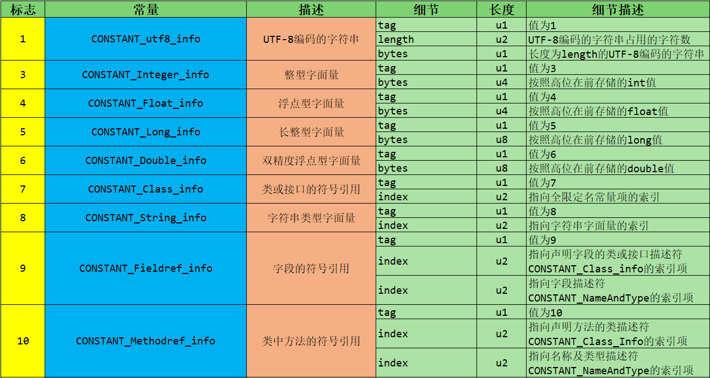

Class文件结构

字节码指令集与解析举例

类的加载过程详解

再谈类加载器

# 概述

## 字节码文件的跨平台性

1.Java语言：跨平台的语言（write once ，run anywhere）

- 当Java源代码成功编译成字节码后，如果想在不同的平台上面运行，则无须再次编译
- 这个优势不再那么吸引人了。Python、 PHP、 Perl、 Ruby、 Lisp等有强大的解释器。
- 跨平台似乎已经快成为一门语言必选的特性。


2.Java虚拟机：跨语言的平台
***Java虚拟机不和包括Java在内的任何语言绑定，它只与“Class文件”这种特定的二进制文件格式所关联。***无论使用何种语言进行软件开发，只要能将源文件编译为正确的Class文件，那么这种语言就可以在Java虚拟机上执行。可以说，统一而强大的Class文件结构，就是Java虚拟机的基石、桥梁。

所有的JVM全部遵守[Java虚拟机规范](https://docs.oracle.com/javase/specs/index.html)，也就是说所有的JVM环境都是一样的，这样一来字节码文件可以在各种JVM上运行。


3.想要让一个Java程序正确地运行在JVM中，Java源码就必须要被编译为符合JVM规范的字节码。

- ***前端编译器的主要任务***就是负责将符合Java语法规范的Java代码转换为符台JVM规范的字节码文件。
- javac是一种能够将Java源码编译为字节码的前端编译器。
- Javac编译器在将Java源码编译为一个有效的字节码文件过程中经历了4个步骤，分别是***词法解析、语法解析、语义解析以及生成字节码。***


Oracle 的 JDK 软件包括两部分内容：

- 一部分是将Java源代码编译成Java虚拟机的指令集的编译器
- 另一部分是用于实现Java虚拟机的运行时环境


## Java的前端编译器

前端编译器 vs 后端编译器


Java源代码的编译结果是字节码，那么肯定需要有一种编译器能够将Java源码编译为字节码，承担这个重要责任的就是配置在path环境变量中的***javac编译器***。javac 是一种能够将Java源码编译为字节码的***前端编译器。***

HotSpot VM并没有强制要求前端编译器只能使用javac来编译字节码，其实只要编译结果符合JVM规范都可以被JVM所识别即可。在Java的前端编译器领域，除了javac之外，还有一种被大家经常用到的前端编译器，那就是内置在 ***Eclipse中的ECJ（EclipseCompiler for Java）编译器。***和Javac的全量式编译不同，ECJ 是一种***增量式编译器***。

- 在Eclipse中，当开发人员编写完代码后，使用“Ctrl+S”快捷键时，ECJ编译器所采取的***编译方案***是把未编译部分的源码逐行进行编译，而非每次都全量编译。因此ECJ的编译效率会比javac更加迅速和高效，当然编译质量和javac相比大致还是一样的。
- ECJ不仅是Eclipse的默认内置前端编译器，在Tomcat中同样也是使用ECJ编译器来编译jsp文件。由于ECJ编译器是采用GPLv2的开源协议进行源代码公开，所以，大家可以登录eclipse官网下载ECJ编译器的源码进行二次开发。
- ***默认情况下，IntelliJ IDEA使用javac编译器。***（还可以自己设置为AspectJ编译器 ajc）前端编译器并不会直接涉及编译优化等方面的技术，而是将这些具体优化细节移交给HotSpot的JIT编译器负责。
- 复习： AOT（静态提前编译器，Ahead Of Time Compiler）


## 透过字节码指令看代码细节

### BAT 面试题

1. 类文件结构有几个部分？
2. 知道字节码吗？ 字节码都有哪些？
3. `Integer x = 5;int y = 5;` 比较 ` x==y`  都经过哪些步骤？

### 代码举例

案例1:

```java
public class IntegerTest {
    public static void main(String[] args) {

        Integer x = 5;
        int y = 5;
        //true x自动拆箱得到基本类型5<java/lang/Integer.intValue>
        System.out.println(x == y); 
      	
        Integer i1 = 10;
        Integer i2 = 10;
      	// //true 用的是IntegerCache中cache数组(-128~127)中的同一个元素
        System.out.println(i1 == i2);

        Integer i3 = 128;
        Integer i4 = 128;
        System.out.println(i3 == i4);//false

    }
}

// 字节码指令
 0 iconst_5
 1 invokestatic #2 <java/lang/Integer.valueOf>
 4 astore_1
 5 iconst_5
 6 istore_2
 7 getstatic #3 <java/lang/System.out>
10 aload_1
11 invokevirtual #4 <java/lang/Integer.intValue>
14 iload_2
15 if_icmpne 22 (+7)
18 iconst_1
19 goto 23 (+4)
22 iconst_0
23 invokevirtual #5 <java/io/PrintStream.println>
26 bipush 10
28 invokestatic #2 <java/lang/Integer.valueOf>
31 astore_3
32 bipush 10
34 invokestatic #2 <java/lang/Integer.valueOf>
37 astore 4
39 getstatic #3 <java/lang/System.out>
42 aload_3
43 aload 4
45 if_acmpne 52 (+7)
48 iconst_1
49 goto 53 (+4)
52 iconst_0
53 invokevirtual #5 <java/io/PrintStream.println>
56 sipush 128
59 invokestatic #2 <java/lang/Integer.valueOf>
62 astore 5
64 sipush 128
67 invokestatic #2 <java/lang/Integer.valueOf>
70 astore 6
72 getstatic #3 <java/lang/System.out>
75 aload 5
77 aload 6
79 if_acmpne 86 (+7)
82 iconst_1
83 goto 87 (+4)
86 iconst_0
87 invokevirtual #5 <java/io/PrintStream.println>
90 return
```

案例2: [string的内存分配]([http://www.silince.cn/2020/08/12/StringTable/#string%E7%9A%84%E5%86%85%E5%AD%98%E5%88%86%E9%85%8D](http://www.silince.cn/2020/08/12/StringTable/#string的内存分配))

```java
public class StringTest {
    public static void main(String[] args) {
        // <java/lang/StringBuilder.toString> --> return new String(value, 0, count);
        String str = new String("hello") + new String("world"); 
      	// ldc #10 <helloworld>
        String str1 = "helloworld";
        System.out.println(str == str1); // false
        String str2 = new String("helloworld");
        System.out.println(str == str2); // false 因为都是新new的
    }

    public void method1(){

    }

    public void method1(int num){

    }

//    public int method1(int num){
//        return 1;
//    }
}

// 字节码指令
 0 new #2 <java/lang/StringBuilder>
 3 dup
 4 invokespecial #3 <java/lang/StringBuilder.<init>>
 7 new #4 <java/lang/String>
10 dup
11 ldc #5 <hello>
13 invokespecial #6 <java/lang/String.<init>>
16 invokevirtual #7 <java/lang/StringBuilder.append>
19 new #4 <java/lang/String>
22 dup
23 ldc #8 <world>
25 invokespecial #6 <java/lang/String.<init>>
28 invokevirtual #7 <java/lang/StringBuilder.append>
31 invokevirtual #9 <java/lang/StringBuilder.toString>
34 astore_1
35 ldc #10 <helloworld>
37 astore_2
38 getstatic #11 <java/lang/System.out>
41 aload_1
42 aload_2
43 if_acmpne 50 (+7)
46 iconst_1
47 goto 51 (+4)
50 iconst_0
51 invokevirtual #12 <java/io/PrintStream.println>
54 new #4 <java/lang/String>
57 dup
58 ldc #10 <helloworld>
60 invokespecial #6 <java/lang/String.<init>>
63 astore_3
64 getstatic #11 <java/lang/System.out>
67 aload_1
68 aload_3
69 if_acmpne 76 (+7)
72 iconst_1
73 goto 77 (+4)
76 iconst_0
77 invokevirtual #12 <java/io/PrintStream.println>
80 return
```

案例3:

```java
/** 
* 成员变量（非静态的）的赋值过程： ① 默认初始化 - ② 显式初始化/代码块中初始化(并列关系 ) - ③ 构造器中初始化 - ④ 有了对象之后，可以“对象.属性”或"对象.方法"的方式对成员变量进行赋值。
*/ 
class Father {
    int x = 10; // 显式初始化

    public Father() {
        this.print();
        x = 20;
    }
    public void print() {
        System.out.println("Father.x = " + x);
    }
}

class Son extends Father {
    int x = 30;
//    float x = 30.1F;
    public Son() {
        this.print();
        x = 40;
    }
    public void print() {
        System.out.println("Son.x = " + x);
    }
}

public class SonTest {
    public static void main(String[] args) {
        Father f = new Son();
        System.out.println(f.x); // ⚠️ 属性不存在多态性，调的是父类中的成员变量x
    }
}

// 运行结果
Son.x = 0
Son.x = 30
20
// 字节码 Son.init
 0 aload_0
 1 invokespecial #1 <com/atguigu/java/Father.<init>> // 调用父类的构造方法 这时其中的print()方法已被Son重写，使用调用的的是  System.out.println("Son.x = " + x);此时Son.x 还未赋值默认初始化为0
 4 aload_0
 5 bipush 30 //  int x = 30;
 7 putfield #2 <com/atguigu/java/Son.x>
10 aload_0
11 invokevirtual #3 <com/atguigu/java/Son.print> // Son.x 已经赋值为30
14 aload_0
15 bipush 40
17 putfield #2 <com/atguigu/java/Son.x>
20 return
// 字节码 Father.init
 0 aload_0
 1 invokespecial #1 <java/lang/Object.<init>>
 4 aload_0
 5 bipush 10
 7 putfield #2 <com/atguigu/java/Father.x>
10 aload_0
11 invokevirtual #3 <com/atguigu/java/Father.print>
14 aload_0
15 bipush 20
17 putfield #2 <com/atguigu/java/Father.x>
20 return

```

---


# 虚拟机的基石：Class文件

## Class文件概述

1.字节码文件里是什么？
源代码经过编译器编译之后便会生成一个字节码文件，字节码是一种二进制的类文件，它的内容是JVM的指令，而不像C、C++经由编译器直接生成***机器码***。


2.什么是字节码指令（byte code）？
Java虚拟机的指令由-个字 节长度的、代表着某种特 定操作含义的***操作码 （opcode）*** 以及跟随其后的零至多 个代表此操作所需参数的***操作数（operand）*** 所构成。虚拟机中许多指令并不包含操作数，只有一个操作码。


3.如何解读供虚拟机解释执行的二进制字节码？

- 一个一个二进制的看。这里用到的是Notepad++，需要安装一个HEX- Editor插件，或者使用Binary Viewer
- 使用 javap 指令：jdk 自带的反解析工具
- ⭐️ 使用IDEA 插件： jclasslib 或 jclasslib bytecode viewer 客户端工具


## Class 类的本质

任何一个Class文件都对应着唯一个 类或接口的定义信息，但反过来说，Class文件实际上它并不一定以磁盘文件的形式存在。Class文件是-组以8位字节为基础单位的***二进制流***。

## Class文件格式

Class的结构不像XML等描述语言，由于它没有任何分隔符号。所以在其中的数据项，无论是字节顺序还是数量，都是被严格限定的，哪个字节代表什么含义，长度是多少，先后顺序如何，都不允许改变。

Class文件格式采用一种类似于C语言结构体的方式进行数据存储，这种结构中只有两种数据类型：***无符号数和表***

- 无符号数属于基本的数据类型，以u1、u2、 u4、u8来分别代表1个字节、2个字节、4个字节和8个字节的无符号数，无符号数可以用来描述数字、索引引用、数量值或者按照 UTF-8 编码构成字符串值。
- 表是由多个无符号数或者其他表作为数据项构成的***复合数据类型***（类似于数组），所有表都习惯性地以“_info" 结尾。表用于描述有层次关系的复合结构的数据，整个Class文件本质上就是一张表。 ***由于表没有固定长度，所以通常会在其前面加上个数说明。***

| 数据类型 | 定义                                                         | 说明                                                         |
| -------- | ------------------------------------------------------------ | ------------------------------------------------------------ |
| 无符号数 | 无符号数可以用来描述数字、索引引用、数量值或按照utf-8编码构成的字符串值。 | 其中无符号数属于基本的数据类型。 以u1、u2、u4、u8来分别代表1个字节、2个字节、4个字节和8个字节 |
| 表       | 表是由多个无符号数或其他表构成的复合数据结构。               | 所有的表都以“_info”结尾。 由于表没有固定长度，所以通常会在其前面加上个数说明。 |

---


# Class文件结构

## 概述

Class文件的结构并不是一成不变的，随着Java虚拟机的不断发展，总是不可避免地会对Class文件结构做出一些调整，但是其基本结构和框架是非常稳定的。
Class文件的总体结构如下：

| 类型           | 名称                | 说明                   | 长度    | 数量                        |
| -------------- | ------------------- | ---------------------- | ------- | --------------------------- |
| u4             | magic               | 魔数,识别Class文件格式 | 4个字节 | 1                           |
| u2             | minor_version       | 副版本号(小版本)       | 2个字节 | 1                           |
| u2             | major_version       | 主版本号(大版本)       | 2个字节 | 1                           |
| u2             | constant_pool_count | 常量池计数器           | 2个字节 | 1                           |
| cp_info        | constant_pool       | 常量池表               | n个字节 | ***constant_pool_count-1*** |
| u2             | access_flags        | 访问标识               | 2个字节 | 1                           |
| u2             | this_class          | 类索引                 | 2个字节 | 1                           |
| u2             | super_class         | 父类索引               | 2个字节 | 1                           |
| u2             | interfaces_count    | 接口计数器             | 2个字节 | 1                           |
| u2             | interfaces          | 接口索引集合           | 2个字节 | interfaces_count            |
| u2             | fields_count        | 字段计数器             | 2个字节 | 1                           |
| field_info     | fields              | 字段表                 | n个字节 | fields_count                |
| u2             | methods_count       | 方法计数器             | 2个字节 | 1                           |
| method_info    | methods             | 方法表                 | n个字节 | methods_count               |
| u2             | attributes_count    | 属性计数器             | 2个字节 | 1                           |
| attribute_info | attributes          | 属性表                 | n个字节 | attributes_count            |

## 魔数

- 每个Class 文件开头的4个字节的无符号整数称为魔数（Magic Number）

- 它的唯一作用是确定这个文件是否为一个能被虚拟机接受的有效合法的Class文件。 即：魔数是Class 文件的标识符。

- 魔数值固定为0xCAFEBABE。不会改变。

- 如果一个Class文件不以0xCAFEBABE开头，虚拟机在进行文件校验的时候就会直接抛出以下错误：

  ```
  Error: A JNI has occurred, please check your installation and try again
  Excepetion in thread "main" java.lang.ClassFormatError: Incompatible magic value 1885430635 in class file StringTest
  ```

- 使用魔数而不是扩展名来进行识别主要是基于安全方面的考虑，因为文件扩展名可以随意地改动


## Class文件版本

- 紧接着魔数的4个字节存储的是Class 文件的版本号。同样也是4个字节。第5个和第6个字节所代表的含义就是编译的副版本号minor_ version，而第7个和第8个字节就是编译的主版本号major_ version。
- 它们共同构成了class文件的格式版本号。譬如某个Class 文件的主版本号为M，副版本号为m，那么这个Class 文件的格式版本号就确定为M. m。
- Java的版本号是从45开始的,DK1.1之后的每个JDK大版本发布主版本号向上加1。
- 不同版本的ava编译器 Class编译的文件对应的版本是不一样的。***目前,高版本的ava虚拟机可以执行由低版本编译器生成的 class文件,但是低版本的ava虚拟机不能执行由高版本编译器生成的Clas文件否则 JVM会抛出java.lang. UnsupportedclassVersionError异常(向下兼容)***
- 在实际应用中，由于开发环境和生产环境的不同，可能会导致该问题的发生。因此，需要我们在开发时，特别注意开发编译的JDK版本和生产环境中的JDK版本是否一致。
  - 虚拟机JDK版本为1.k(k>=2)时，对应class文件格式版本号的范围为 `[45.0,44+k.0]`
- 版本号和Java编译器的对应关系如下表：

| 主版本（十进制） | 副版本（十进制） | 编译器版本 |
| ---------------- | ---------------- | ---------- |
| 45               | 3                | 1.1        |
| 46               | 0                | 1.2        |
| 47               | 0                | 1.3        |
| 48               | 0                | 1.4        |
| 49               | 0                | 1.5        |
| 50               | 0                | 1.6        |
| 51               | 0                | 1.7        |
| 52               | 0                | 1.8        |
| 53               | 0                | 1.9        |
| 54               | 0                | 1.10       |
| 55               | 0                | 1.11       |


## 常量池

- 常量池是Class文件中内容最为丰富的区域之一。常量池对于Class文件中的字段和方法解析也有着至关重要的作用。
- 随着Java虚拟机的不断发展，常量池的内容也日渐丰富。可以说，常量池是整个Class文件的基石。
- 在版本号之后，紧跟着的是产量池的数量，以及若干个常量池表项。
- 常量池中常量的数量是不固定的，所以在常量池的入口需要放置一项u2类型的无符号数，代表常量池容量计数值(constant_pool_count)。与Java语言习惯不一样的是，这个容量计数是从1而不是0开始的。
- 如下图可见，Class 文件使用了一个前置的容量计数器(constant_pool_count)加若干个连续的数据项(constant_pool)的形式来描述常量池的内容。我们把这一系列连续常量池数据称为常量池集合。


- 常量池表项中，用于存放编译时期生成的各种***字面量和符号引用***，这部分内容将在类加载后进入方法区的***运行时常量池中存放***。


### 常量池计数器

- 由于常量池的数量不固定，时长时短，所以需要放置两个字节来表示常量池容量计数值。
- 常量池容量计数值（u2类型）：从1开始，表示常量池中有多少项常量。即 `constant_pool_count-1`表示常量池中有0个常量项。

- 案例中对应项的值为 `0x0016` , 也就是22。
  - 实际上只有21项常量。索引的范围为1-21
  - 通常我们写代码时都是从0开始的，但是这里的常量池却是从1开始，因为它把第0项常量空出来了。这是为了满足后面***某些指向常星池的索引值的数据在特定情况下需要表达“不引用任何一个常量池项目”的含义，这种情况可用索引值0来表示。***

### 常量池表

#### 常量类型和结构

- constant_ pool是一种表结构，以1 ~ constant_ pool_ count - 1为索引。 表明了后面有多少个常量项。
- 常量池主要存放两大类常量:***字面量（Literal） 和符号引用（Symbolic References）***
- 它包含了class文件结构及其子结构中引用的所有字符串常量、类或接口名、字段名和其他常量。常量池中的每一项都具备相同的特征。第1个字节作为类型标记，用于确定该项的格式，这个字节称为 ***tag byte （标记字节、 标签字节）。***




- 根据上图每个类型的描述我们也可以知道每个类型是用来描述常量池中哪些内容（主要是字面量、符号引用）的。比如:CONSTANT_Integer_info是用来描述常量池中字面量信息的，而且只是整型字面量信息。
- ***标志为15、16、 18的常量项类型是用来支持动态语言调用的（jdk1.7时才 加入的）***
- 细节说明:
  - CONSTANT_ Class_ info 结构用于表示类或接口
  - CONSTANT Fieldref_ info、 CONSTANT_Methodref_ info 和ICONSTANT_InterfaceMethodref_ info结构表示字段、方法和接口方法
  - CONSTANT string info结构用于表示String类型的常量对象
  - CONSTANT_ Integer_ info和 CONSTANT Float_ info 表示4字节（int 和float）的数值常量
  - CONSTANT_Long_info和 CONSTANT_Double_info结构表示8字节（long和Idouble）的数值常量
    - 在class文件的常量池表中，所有的8字节常量均占两个表成员（项）的空间。如果个CONSTANT_Long_info或CONSTAN_ Double_ info结构的项在常量池表中的索引位n，则常量池表中下个可用项的索引位n+2.此时常量池表中索引为n+1的项仍然有效但必领视为不可用的。
  - CONSTANT_ NameAndType_ info结构用于表示字段或方法，但是和之前的3个结构不同，CONSTANT_NameAndType_info结构没有指明该字段或方法所属的类或接口。
  - CONSTANT Utf8 info用于表示字符常量的值
  - CONSTANT MethodHandle_ info结 构用于表示方法句柄
  - CONSTANT_ MethodType_ _info结构表示方法类型_
  - CONSTANT_ InvokeDynamic_ info结构用于表示invokedynamic指令所用到的引导方法（bootstrap method）、 引导方法所用到的动态调用名称（dynamicinvocation name）、 参数和返回类型，并可以给引导方法传入一系列称为静态多数（static argument）的常量。


#### 字面量和符号引用

在对这些常量解读前，我们需要搞清楚几个概念。
常量池主要存放两大类常量:字面量（Literal） 和符号引用（ Symbolic References）。 如下表:

| 常量     | 具体的常量                             |
| -------- | -------------------------------------- |
| 字面量   | 文本字符串 `String str = "Silince";`   |
|          | 声明为final的常量值`final int NUM=10;` |
| 符号引用 | 类和接口的全限定名                     |
|          | 字段的名称和描述符                     |
|          | 方法的名称和描述符                     |

- 全限定名
  `com/ atguigu/test/Demo`这个就是类的全限定名，仅仅是把包名的". "替换成"/"，为了使连续的多个全限定名之间不产生混淆，在使用时最后一般会加入一个 “；”表示全限定名结束。
- 简单名称
  简单名称是指没有类型和参数修饰的方法或者字段名称，上面例子中的类的`add()`方法和num字段的简单名称分别是add和num。
- 描述符
  ***描述符的作用是用来描述字段的数据类型、方法的参数列表（包括数量、类型以及顺序）和返回值。***根据描述符规则，基本数据类型（byte、char、double、float、 int、long、short、 boolean）以及代表无返回值的void类型都用一个大写字符来表示，而对象类型则用字符L加对象的全限定名来表示，详见下表:

| 标志符 | 含义                                                 |
| ------ | ---------------------------------------------------- |
| B      | 基本数据类型byte                                     |
| C      | 基本数据类型char                                     |
| D      | 基本数据类型double                                   |
| F      | 基本数据类型float                                    |
| I      | 基本数据类型int                                      |
| J      | 基本数据类型long                                     |
| S      | 基本数据类型short                                    |
| Z      | 基本数据类型boolean                                  |
| V      | 代表void类型                                         |
| L      | 对象类型，比如：`Ljava/lang/Object;`                 |
| [      | 数组类型，代表一维数组。比如：`double[][][] is [[[D` |

补充说明: 
虚拟机在加载Class文件时才会进行动态链接，也就是说， Class 文件中不会保存各个方法和字段的最终内存布局信息，因此，这些字段和方法的符号引用不经过转换是无法直接被虚拟机使用的。***当虚拟机运行时，需要从常量池中获得对应的符号引用，再在类加载过程中的解析阶段将其替换为直接引用，并翻译到具体的内存地址中。***
这里说明下符号引用和直接引用的区别与关联:

- 符号引用:符号引用以***一组符号***来描述所引用的目标，符号可以是任何形式的字面量，只要使用时能无歧义地定位到目标即可。***符号引用与虚拟机实现的内存布局无关，引用的目标并不一 定经加载到了内存中。***
- 直接引用:直接引用可以是直接***指向目标的指针、相对偏移量或是一 个能间接定位到目标的句柄。 直接引用是与虚拟机实现的内存布局相关的***，同个符号引用在不同虚拟机实例上翻译出来的直接引用般不会相同。如果有了直接引用，那说明引用的目标必定经存在于内存之中了。   


#### 小结

- 这14种表（或者常量项结构）的共同点是:表开始的第一位是一个u1类型的标志位（tag） ，代表当前这个常量项使用的是哪种表结构，即哪种常量类型。
- 在常量池列表中，CONSTANT_Utf8_ info常量项是一种使用改进过的UTF -8编码格式来存储诸如文字字符串、类或者接口的全限定名、字段或者方法的简单名称以及描述符等常量字符串信息。
- 这14种常量项结构还有一个特点是，其中13个常量项占用的字节固定，只有CONSTANT_Utf8_ info占用字节不固定，其大小由length决定。为什么呢？***因为从常量池存放的内容可知，其存放的是字面量和符号引用，最终这些内容都会是一个字符串，这些字符串的大小是在编写程序时才确定***，比如你定义一个类， 类名可以取长取短，所以在没编译前， 大小不固定。编译后，通过utf-8编码，就可以知道其长度。


- 常量池:***可以理解为Class文件之中的资源仓库***，它是Class文件结构中与其他项目关联最多的数据类型（后面的很多数据类型都会指向此处），也是占用Class文件空间最大的数据项目之一。
- 常量池中为什么要包含这些内容 ?
  Java代码在进行Javac编译的时候，并不像C和C++那样有“连接”这一步骤，而是在虚拟机加载Class文件的时候进行动态链接。也就是说，***在Class文件中不会保存各个方法、字段的最终内存布局信息，因此这些字段、方法的符号引用不经过运行期转换的话无法得到真正的内存入口地址，也就无法直接被虚拟机使用。***当虚拟机运行时，需要从常量池获得对应的符号引用，再在类创建时或运行时解析、翻译到具体的内存地址之中。关于类的创建和动态链接的内容，在虚拟机类加载过程时再进行详细讲解。


## 访问标志

在常量池后，紧跟着访问标记。该标记使用两个字节表示，用于识别一些类或者接口层次的访问信息，包括:这个Class 是类还是接口；是否定义为public类型；是否定义为abstract 类型；如果是类的话，是否被声明为final等。各种访问标记如下所示:

| 标志名称       | 标志值 | 含义                                                         |
| -------------- | ------ | ------------------------------------------------------------ |
| ACC_PUBLIC     | 0x0001 | 标志为public类型                                             |
| ACC_FINAL      | 0x0010 | 标志被声明为final，只有类可以设置                            |
| ACC_SUPER      | 0x0020 | 标志允许使用invokespecial字节码指令的新语义，JDK1.0.2之后编译出来的类的这个标志默认为真。（使用增强的方法调用父类方法） |
| ACC_INTERFACE  | 0x0200 | 标志这是一个接口                                             |
| ACC_ABSTRACT   | 0x0400 | 是否为abstract类型，对于接口或者抽象类来说，次标志值为真，其他类型为假 |
| ACC_SYNTHETIC  | 0x1000 | 标志此类并非由用户代码产生（即：由编译器产生的类，没有源码对应） |
| ACC_ANNOTATION | 0x2000 | 标志这是一个注解                                             |
| ACC_ENUM       | 0x4000 | 标志这是一个枚举                                             |

- 类的访问权限通常为`ACC_ `开头的常量。
- 每一种类型的表示都是通过设置访问标记的32位中的特定位来实现的。比如，若是`public final`的类，则该标记为`ACC_ PUBLIC| ACC_ FINAL`。
- 使用`ACC_ SUPER`可以让类更准确地定位到父类的方法`super.method()`，现代编译器都会设置并且使用这个标记。

补充说明：

1. 带有ACC_ _INTERFACE 标志的 class文件表示的是接口而不是类，反之则表示的是类而不是接口。_
   - **如果一个class文件被设置了ACC_INTERFACE 标志，那么同时也得设置ACC_ ABSTRACT 标志。同时它不能再设置ACC_ _FINAL、 
     ACC_SUPER或ACC_ENUM 标志。_**
   - **如果没有设置ACC_ INTERFACE标志，那么这个class文件可以具有上表中除ACC_ ANNOTATION外的其他所有标志。当然，ACC_FINAL和ACC_ ABSTRACT这类互斥的标志除外。这两个标志不得同时设置。**
2. ACC_SUPER标志用于确定类或接口里面的invokespecial指令使用的是哪一种执行语义。***针对Java虚拟机指令集的编译器都应当设置这个标志。***对于Java SE 8及后续版本来说，无论class文件中这个标志的实际值是什么，也不管class文件的版本号是多少，Java 虚拟机都认为每个class文件均设置了ACC_ SUPER标志。
   - **ACC_ SUPER标志是为了向后兼容由旧Java编译器所编译的代码而设计的。目前的ACC_ SUPER标志在由JDK 1.0.2之前的编译器所生成的access_ flags中是没有确定含义的，如果设置了该标志，那么Oracle的Java虚拟机实现会将其忽略。**
3. ACC_SYNTHETIC标志意味着该类或接口是由编译器生成的，而不是由源代码生成的。
4. 注解类型必须设置ACC_ ANNOTATION标志。 如果设置了ACC_ANNOTATION标志， 那么也必须设置ACC_INTERFACE标志。
5. ACC_ENUM标志表明该类或其父类为枚举类型。


## 类索引，父类索引，接口索引集合

在访问标记之后，会指定该类的类别、父类类别以及实现的接口，格式如下：

| 长度 | 含义                         |
| ---- | ---------------------------- |
| u2   | this_class                   |
| u2   | super_class                  |
| u2   | interfaces_count             |
| u2   | interfaces[interfaces_count] |

这三项数据来确定这个类的继承关系。

- 类索引用于确定这个类的全限定名
- 父类索引用于确定这个类的父类的全限定名。由于Java语言不允许多重继承，所以父类索引只有一个，除了java.lang .0bject之外，所有的Java类都有父类，因此除了java. lang. object外，所有Java类的父类索引都不为0。
- 接口索引集合就用来描述这个类实现了哪些接口，这些被实现的接口将按implements 语句（如果这个类本身是个接口，则应当是extends 语句）后的接口顺序从左到右排列在接口索引集合中。

### this_class（类索引）

2字节无符号整数，指向常量池的索引。它提供了类的全限定名，如com/atguigu/java1/Demo。this_class的值必须是对常量池表中某项的一一个有效索引值。常量池在这个索引处的成员必须为CONSTANT_Class_info类 型结构体，该结构体表示这个class文件所定义的类或接口。


## 字段表集合

数据类型和默认初始值对应

| 类型      | 默认初始值 |
| --------- | ---------- |
| byte      | (byte)0    |
| short     | (short)0   |
| int       | 0          |
| long      | 0L         |
| float     | 0.0f       |
| double    | 0.0        |
| char      | \u0000     |
| boolean   | false      |
| reference | null       |


## 方法表集合

## 属性表集合

## 案例

```java
public class Demo {
    private int num = 1;

    public int add(){
        num = num + 2;
        return num;
    }
}
```


---


# 使用javap指令解析Class文件

## javap的用法

## 使用举例

## 总结